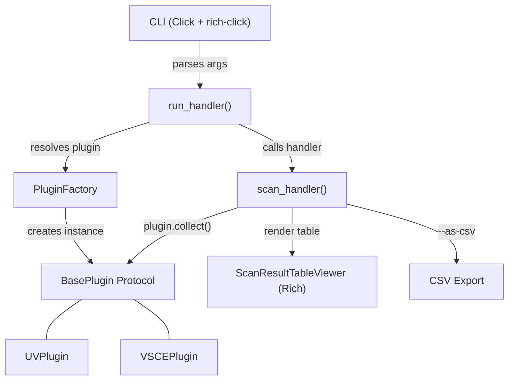
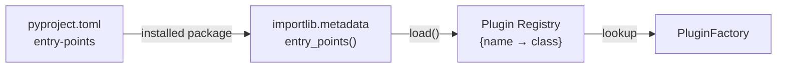
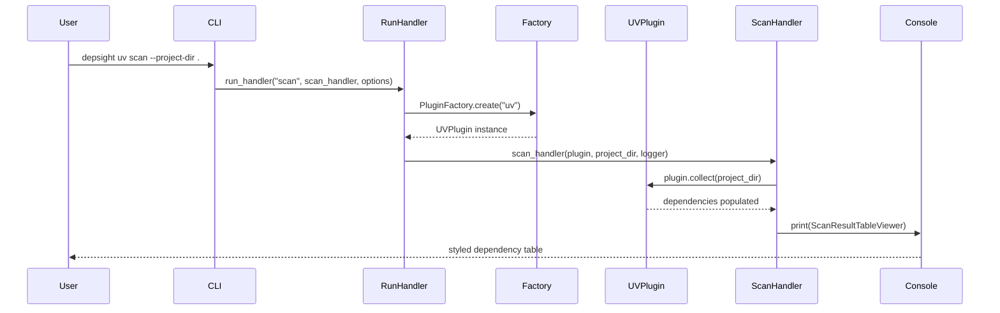

# Architecture & Design Patterns

Depsight follows a plugin-based architecture that makes it straightforward to add support for new package managers. This page explains the core patterns — plugin discovery, the factory, data models, and the terminal UI.

---

## High-Level Architecture



A CLI command flows through the **run handler**, which uses the **factory** to create a plugin instance, then delegates to the appropriate **command handler** (e.g. `scan_handler`).

---

## Plugin System

### Entry-Point Discovery

Plugins are registered as Python **entry points** in `pyproject.toml`:

```toml
[project.entry-points."depsight.plugins"]
uv   = "depsight.core.plugins.uv.uv:UVPlugin"
vsce = "depsight.core.plugins.vsce.vsce:VSCEPlugin"
```

At startup, `discover_plugins()` queries the `depsight.plugins` entry-point group and builds a name → class registry:

```python
def discover_plugins(app_name: str) -> dict:
    registry: dict[str, type] = {}
    entry_points = importlib.metadata.entry_points(group=f"{app_name}.plugins")
    for ep in entry_points:
        plugin_cls = ep.load()
        registry[ep.name] = plugin_cls
    return registry
```

This means third-party packages can register their own plugins simply by declaring an entry point — no changes to the Depsight codebase required.



### The BasePlugin Protocol

The plugin contract is defined as a **Protocol** (PEP 544) rather than an abstract base class. This enables structural ("duck") typing — any class that implements the required attributes and methods satisfies the protocol, without needing explicit inheritance.

```python
@runtime_checkable
class BasePlugin(Protocol):

    dependencies: list[Dependency]

    @property
    @abstractmethod
    def name(self) -> str: ...

    def collect(self, path: str | Path) -> None: ...

    def export(self, project_dir: str | Path, output_dir: str | Path) -> Path: ...
```

| Member | Purpose |
|--------|---------|
| `dependencies` | Populated by `collect()` — list of discovered dependencies |
| `name` | Canonical name of the package manager (e.g. `"uv"`) |
| `collect(path)` | Parse dependency files and populate `self.dependencies` |
| `export(...)` | Write dependencies to a CSV file and return the path |

### Factory Pattern

`PluginFactory` encapsulates plugin creation and validation:

```python
class PluginFactory:
    @staticmethod
    def create(plugin_name: str) -> BasePlugin:
        plugin_cls = SUPPORTED_PLUGINS.get(plugin_name)
        if plugin_cls is None:
            raise ValueError(f"Unknown plugin '{plugin_name}'")

        plugin = plugin_cls()

        if not isinstance(plugin, BasePlugin):
            raise TypeError("Plugin doesn't implement BasePlugin")

        return plugin
```

The factory:

1. Looks up the class in the plugin registry
2. Instantiates it
3. Validates it against the `BasePlugin` protocol at runtime
4. Returns a ready-to-use plugin instance

---

## Dependency Data Model

Every plugin produces a list of `Dependency` dataclass instances:

```python
type packageType = Literal["dev", "prod"]

@dataclass(slots=True)
class Dependency:
    name: str
    version: str | None = None
    constraint: str | None = None
    tool_name: str | None = None
    registry: str | None = None
    file: str | None = None
    category: packageType = "prod"
```

| Field | Example | Description |
|-------|---------|-------------|
| `name` | `"click"` | Package identifier |
| `version` | `"8.3.1"` | Resolved version from lockfile |
| `constraint` | `">=8.1.7"` | Version specifier from manifest |
| `tool_name` | `"uv"` | Which plugin discovered it |
| `registry` | `"https://pypi.org/simple"` | Package registry URL |
| `file` | `"/project/uv.lock"` | Source file path |
| `category` | `"dev"` or `"prod"` | Dependency classification |

---

## Built-in Plugins

### UVPlugin

Parses `uv.lock` files (TOML format) to extract Python dependencies.

**Collection logic:**

1. Locate `uv.lock` — checks the project root, then walks subdirectories
2. Parse with `tomllib` and iterate over `[[package]]` sections
3. Identify the editable package block (the project itself)
4. Classify dependencies as **prod** (runtime) or **dev** (optional/dev groups)
5. Extract version constraints from `metadata.requires-dist`

### VSCEPlugin

Parses `devcontainer.json` files to extract VS Code extension dependencies.

**Collection logic:**

1. Walk the project directory for `devcontainer.json` files
2. Strip single-line comments (JSONC support) and parse as JSON
3. Read extensions from `customizations.vscode.extensions`
4. Create a `Dependency` per extension with `category="dev"`

---

## CLI Structure

The CLI is built with **Click** and styled with **rich-click**. Plugins are dynamically registered as subcommand groups at import time:

```python
for plugin_name in SUPPORTED_PLUGINS:
    _register_plugin(plugin_name)
```

Each plugin gets its own command group with a `scan` subcommand:

```
depsight
├── uv
│   └── scan --project-dir <path> [--verbose] [--as-csv]
└── vsce
    └── scan --project-dir <path> [--verbose] [--as-csv]
```

The `_register_plugin()` function creates a Click group and attaches the scan command, storing the plugin name in Click's context object:

```python
def _register_plugin(plugin_name: str):
    @main.group(plugin_name)
    @click.pass_context
    def plugin_group(ctx):
        ctx.ensure_object(dict)
        ctx.obj["plugin_name"] = plugin_name

    @plugin_group.command("scan")
    @click.option("--project-dir", type=click.Path(exists=True), required=True)
    @click.option("--verbose", is_flag=True)
    @click.option("--as-csv", is_flag=True)
    @click.pass_context
    def scan(ctx, project_dir, verbose, as_csv):
        options = {
            "plugin_name": ctx.obj["plugin_name"],
            "project_dir": project_dir,
            "verbose": verbose,
            "as_csv": as_csv,
        }
        sys.exit(run_handler("scan", scan_handler, options))
```

---

## Terminal UI

Depsight uses **Rich** to render styled tables in the terminal. The `ScanResultTableViewer` class implements the `__rich__` protocol, making it directly printable by Rich's `Console`:

```python
class ScanResultTableViewer:
    def __init__(self, result: list[Dependency]) -> None:
        self.result = result

    def __rich__(self) -> Table:
        table = Table(box=box.SIMPLE_HEAVY, expand=False)
        table.add_column("Package", min_width=14)
        table.add_column("Version", justify="right")
        table.add_column("Category", justify="center")
        table.add_column("Constraint", justify="center")
        table.add_column("Registry", max_width=30)

        for dep in self.result:
            table.add_row(
                dep.name,
                dep.version or "—",
                dep.category or "prod",
                dep.constraint or "—",
                dep.registry or "—",
            )
        return table
```

The scan handler uses it like this:

```python
viewer = ScanResultTableViewer(plugin.dependencies)
console.print(viewer)
```

Output is color-coded: **peach** (`#FFDAB9`) for production dependencies and **peru** (`#CD853F`) for dev dependencies and table borders.

---

## Execution Flow

Putting it all together — here is the full lifecycle of a `depsight uv scan` command:


