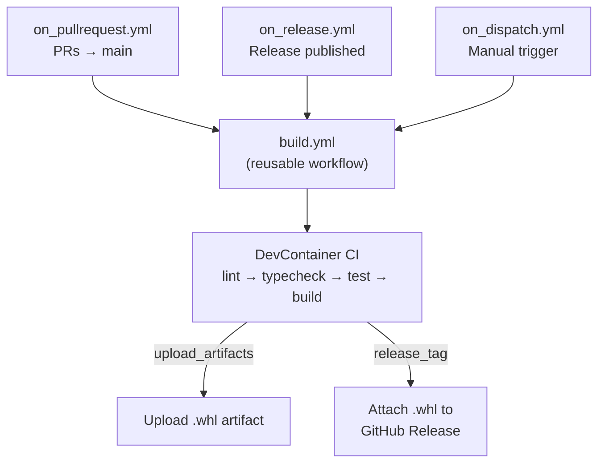
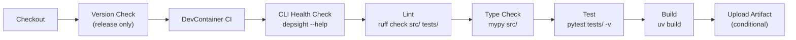
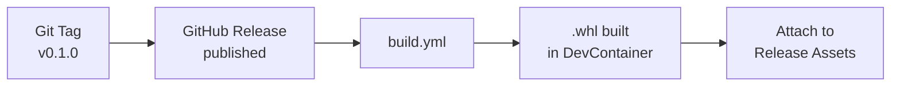

# CI/CD & Packaging

Depsight uses **GitHub Actions** for continuous integration and **Python wheels** for distribution. This page covers the workflow setup, build pipeline, and release process.

---

## GitHub Actions Overview

All workflows live in `.github/workflows/` and share a single reusable build workflow:



### Trigger Workflows

| Workflow | Trigger | Purpose |
|----------|---------|---------|
| `on_pullrequest.yml` | PR to `main` | Run checks on every pull request |
| `on_release.yml` | Release published | Build and attach wheel to the GitHub Release |
| `on_dispatch.yml` | Manual (Actions UI) | Ad-hoc builds with custom Python/uv versions |

Pull request builds ignore changes to documentation files and `README.md` to avoid unnecessary CI runs.

### Reusable Build Workflow

`build.yml` is the core pipeline, called by all trigger workflows. It accepts these inputs:

| Input | Default | Description |
|-------|---------|-------------|
| `python_version` | `3.12` | Python version for the container |
| `uv_version` | `0.10.9` | uv version to install |
| `release_tag` | — | Git tag to verify against `pyproject.toml` version |
| `upload_artifacts` | `false` | Whether to upload the wheel as a workflow artifact |

---

## Build Pipeline

The pipeline runs inside the project's **DevContainer** using the [`devcontainers/ci`](https://github.com/devcontainers/ci) action. This guarantees the CI environment matches the local development environment exactly.

### Pipeline Steps



**Inside the DevContainer**, the following commands run sequentially:

```bash
# Verify the CLI is functional
depsight --help

# Lint with ruff
ruff check src/ tests/

# Type-check with mypy
mypy src/

# Run the test suite
python -m pytest tests/ -v

# Build the wheel
uv build
```

### Version Verification

On release builds, the workflow compares the Git tag against the version in `pyproject.toml`. If they don't match, the build fails — preventing accidental version mismatches.

---

## Python Wheels

Depsight is packaged as a Python **wheel** (`.whl`) — the standard binary distribution format for Python packages.

### Build System

The build backend is **setuptools**, configured in `pyproject.toml`:

```toml
[build-system]
requires = ["setuptools>=61.0"]
build-backend = "setuptools.build_meta"
```

### Building Locally

```bash
# Build the wheel (outputs to dist/)
uv build
```

This produces two files in `dist/`:

```
dist/
├── depsight-0.1.0-py3-none-any.whl    # Wheel (binary distribution)
└── depsight-0.1.0.tar.gz              # Source distribution
```

### What's Inside the Wheel

A wheel bundles the source code, metadata, and entry-point declarations:

```
depsight-0.1.0-py3-none-any.whl
├── depsight/
│   ├── __init__.py
│   ├── cli.py
│   ├── commands/...
│   ├── core/...
│   └── utils/...
└── depsight-0.1.0.dist-info/
    ├── METADATA          # Package name, version, dependencies
    ├── entry_points.txt  # CLI + plugin entry points
    └── RECORD            # File checksums
```

The `entry_points.txt` registers both the CLI command and the plugin system:

```ini
[console_scripts]
depsight = depsight.cli:main

[depsight.plugins]
uv = depsight.core.plugins.uv.uv:UVPlugin
vsce = depsight.core.plugins.vsce.vsce:VSCEPlugin
```

### Installing the Wheel

```bash
# Install directly from the wheel file
pip install dist/depsight-0.1.0-py3-none-any.whl

# Or install in development mode (editable)
uv sync
```

---

## Artifact Handling

### Workflow Artifacts

When `upload_artifacts` is enabled (manual dispatch), the built wheel is uploaded as a GitHub Actions artifact with a **14-day retention period**. This is useful for testing pre-release builds.

### Release Artifacts

When a GitHub Release is published, the `on_release.yml` workflow builds the wheel and attaches it directly to the release. Users can download the `.whl` file from the release page.



---

## Summary

| Aspect | Tool / Approach |
|--------|----------------|
| **CI environment** | DevContainer (identical to local dev) |
| **Linting** | ruff |
| **Type checking** | mypy |
| **Testing** | pytest |
| **Build** | setuptools + `uv build` |
| **Distribution** | Python wheel (`.whl`) |
| **Release flow** | Git tag → GitHub Release → wheel attached |
