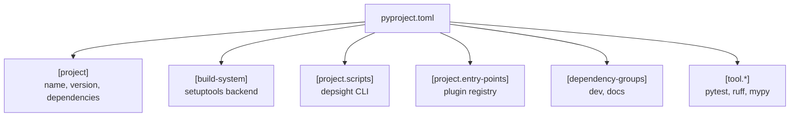

# Project Configuration — pyproject.toml

Depsight uses `pyproject.toml` as the single source of truth for project metadata, dependencies, build configuration, entry points, and tool settings. This is the modern standard defined in [PEP 621](https://peps.python.org/pep-0621/) and replaces the legacy approach of maintaining separate `setup.py`, `setup.cfg`, `requirements.txt`, and `MANIFEST.in` files.

---

## Why pyproject.toml?

Older Python projects required a combination of files to configure packaging and tooling:

| Legacy file | Purpose | Replaced by |
|-------------|---------|-------------|
| `setup.py` | Build script (imperative Python code) | `[build-system]` + `[project]` |
| `setup.cfg` | Declarative metadata for setuptools | `[project]` |
| `requirements.txt` | Dependency pinning | `[project.dependencies]` + `uv.lock` |
| `MANIFEST.in` | Source distribution file list | Automatic with modern build backends |

With `pyproject.toml`, all of this lives in a single, declarative TOML file. Benefits:

- **One file** — No more guessing which of five files controls what.
- **Declarative** — No executable code in the build configuration. Just data.
- **Standardized** — Defined by PEPs, supported by all modern Python tools (pip, uv, setuptools, hatch, flit, etc.).
- **Tool configuration** — Linters, formatters, and test runners read their settings from the same file.

---

## Structure

Depsight's `pyproject.toml` breaks down into these sections:

### Project Metadata

```toml
[project]
name = "depsight"
version = "0.1.0"
description = "A modular dependency analysis framework"
dependencies = [
    "click>=8.1.7",
    "rich>=13.7.0",
    "rich-click>=1.7.0",
]
```

This declares the package name, version, description, and runtime dependencies — the information that used to live in `setup.py` or `setup.cfg`.

### Build System

```toml
[build-system]
requires = ["setuptools>=61.0"]
build-backend = "setuptools.build_meta"
```

Tells tools like `uv build` or `pip wheel` which backend to use for building the package. This replaces the old `setup.py` build script entirely.

### CLI Entry Point

```toml
[project.scripts]
depsight = "depsight.cli:main"
```

Registers the `depsight` command. When the package is installed, this creates a console script that calls `depsight.cli:main`. Equivalent to the old `entry_points` argument in `setup()`.

### Plugin Entry Points

```toml
[project.entry-points."depsight.plugins"]
uv = "depsight.core.plugins.uv.uv:UVPlugin"
vsce = "depsight.core.plugins.vsce.vsce:VSCEPlugin"
```

Registers plugins under the `depsight.plugins` entry-point group. At runtime, `discover_plugins()` queries this group to build the plugin registry. Third-party packages can register additional plugins by declaring their own entry points in this same group.

### Dependency Groups

```toml
[dependency-groups]
dev = [
    "mypy>=1.10",
    "pytest>=8.0",
    "ruff>=0.4",
]
docs = [
    "mkdocs>=1.6",
    "mkdocs-material>=9.5",
    "mkdocs-mermaid2-plugin>=1.1",
]
```

Groups separate development and documentation dependencies from the runtime set. They are installed with `uv sync --group <name>` or `uv sync --all-groups`.

### Tool Configuration

```toml
[tool.pytest.ini_options]
testpaths = ["tests"]
pythonpath = ["src"]
```

Tool-specific settings (pytest, ruff, mypy, etc.) can also live in `pyproject.toml` under the `[tool.<name>]` namespace, keeping everything in one place.

---

## At a Glance


