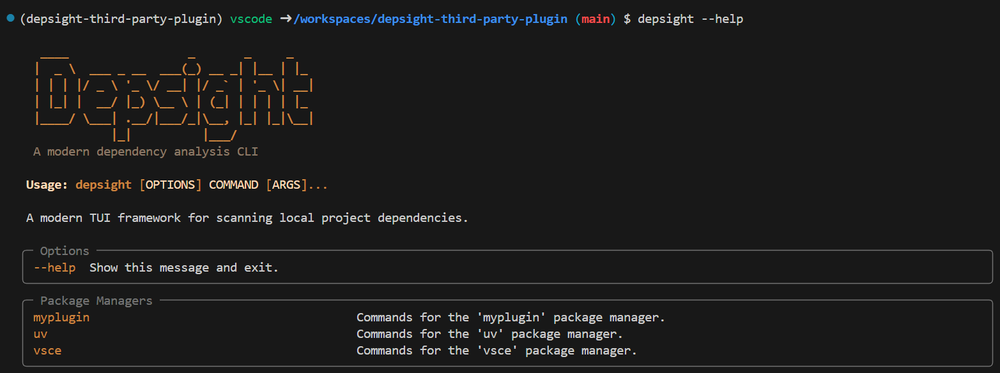
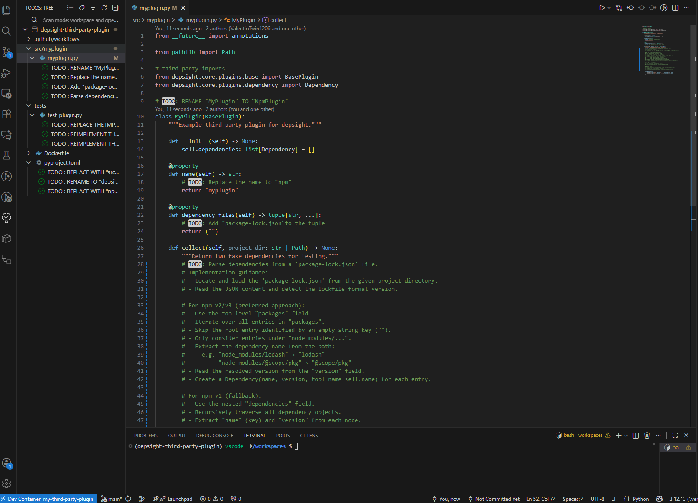

# Task 1: Write an NPM Plugin

## Task

With the [DevContainer environment set up](../getting-started/getting-started.md), `depsight` is available directly from the command line:



Your first task is to implement an **NPM plugin for Depsight** that exposes a `depsight npm scan` command. 


## Hints

### Download Fancy Fileserver Project

To begin with, open a terminal in the DevContainer and download the ['fancy-fileserver'](https://github.com/ValentinTwin1206/fancy-fileserver) project. You can use the project to verify if your implementation works as expected:

```bash
git clone https://github.com/ValentinTwin1206/fancy-fileserver.git /workspaces/fancy-fileserver
```

### NPM Dependencies

We are focusing on the `package-lock.json` file that records the **exact dependency tree** of a project to ensure consistent and repeatable installations.

- **Exact Versions**  
  Each dependency is locked to a specific version. This prevents unexpected changes when installing packages later.

- **Dependency Tree**  
  The file includes not only direct dependencies but also all nested (transitive) dependencies required by them.

- **Resolved Sources**  
  It stores where each package was downloaded from (e.g., registry URL).

- **Integrity Checks**  
  Hashes are included to verify that installed packages have not been altered.

Below is a simplified example (based on `package-lock.json`) showing how dependencies are declared:

```json
{
  "name": "fancy-file-server",
  "version": "0.1.0",
  "lockfileVersion": 3,
  "requires": true,
  "packages": {
    "": {
      "name": "fancy-file-server",
      "version": "0.1.0",
      "dependencies": {
        "ajv": "^8.17.1",
        "bcrypt": "^5.1.0",
        "fastify": "^4.23.0",
        "redis": "^4.6.13"
      },
      "devDependencies": {
        "@faker-js/faker": "^10.0.0",
        "@playwright/test": "^1.57.0",
        "artillery": "^2.0.27",
        "bun-types": "^1.3.0",
        "playwright": "^1.57.0"
      }
    },
     "node_modules/@artilleryio/int-commons": {
      "version": "2.18.0",
      "resolved": "https://registry.npmjs.org/@artilleryio/int-commons/-/int-commons-2.18.0.tgz",
      "integrity": "sha512-wPxDDEvKXg/LqbRpUlJ5/Tw702l+WPav9K8HW0MAqd6Oy53EwhNBG8UK1IlY3yqy1m8Dc3yHQPNrM+UJUZzVBw==",
      "dev": true,
      "license": "MPL-2.0",
      "dependencies": {
        "async": "^2.6.4",
        "cheerio": "^1.0.0-rc.10",
        "debug": "^4.4.1",
        "deep-for-each": "^3.0.0",
        "espree": "^9.4.1",
        "jsonpath-plus": "^10.0.0",
        "lodash": "^4.17.19",
        "ms": "^2.1.3"
      }
    },
  }
}
```

### Inline TODOs

The template repository already provides the plumbing required to run a working **"Hello World" plugin**. Thus, you do not need to set up the plugin structure from scratch; however, you are free to add additional Python modules to keep the architecture clean.

The DevContainer comes with the [Todo Tree](https://marketplace.visualstudio.com/items?itemName=Gruntfuggly.todo-tree) extension pre-installed. It scans your workspace for inline `# TODO` comments and displays them in a structured tree view, giving you a clear overview of every step that still needs to be implemented.



Throughout the plugin source code you will find a series of `# TODO` comments. Each one marks a specific step you need to complete in order to implement a fully working NPM plugin. Simply follow the TODOs since they guide you through reading `package-lock.json`, collecting dependencies, and wiring up the `depsight npm scan` command.

!!! warning "Skip the `build.yml` and `Dockerfile`"
    Implement all TODOs **except** the one inside the `Dockerfile` and `.github/workflows/build.yml`. That TODO is covered in [Task 2](task-2-package-and-publish-your-plugin.md).

