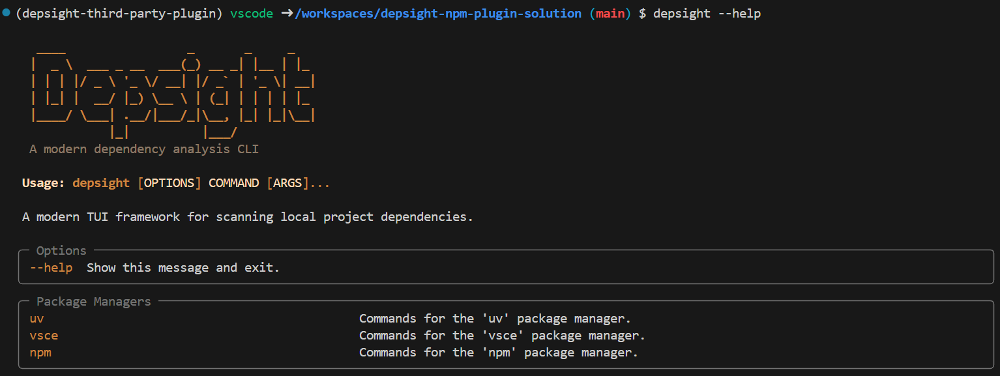

# Task 2: Scan Dependencies

## Task

With the [NPM plugin implemented](./task-1-write-a-npm-plugin.md), an `npm` command should be available directly via the `depsight` command line interface:



Your next task is to **scan the project dependencies** of the target ['fancy-fileserver'](https://github.com/ValentinTwin1206/fancy-fileserver) project using the built-in plugin `vsce` and your third-party plugin `npm`. Run a dependency scan with each plugin individually. Both plugins support an option to export the discovered dependencies as a CSV file. You have to use this option for each scan so you end up with two separate CSV exports, one per plugin.

!!! info "Fancy Fileserver Already Packaged"
    The `fancy-fileserver` repository is already available inside the DevContainer environment under `~/fancy-fileserver`.

## Hints

You can use the `--help` flag to explore the functionalities of `depsight`. 

- To understand the global entry-point run:
  
    ```bash
    depsight --help
    ```

- To understand the usage for a plugin run:
  
    ```bash
    depsight {PLUGIN} --help
    ```

    > You can substitute {PLUGIN} with `npm`, `vsce`, ...

- To understand the usage of the `scan` command of a plugin run:
  
    ```bash
    depsight {PLUGIN} scan --help
    ```

    > You can substitute {PLUGIN} with `npm`, `vsce`, ...