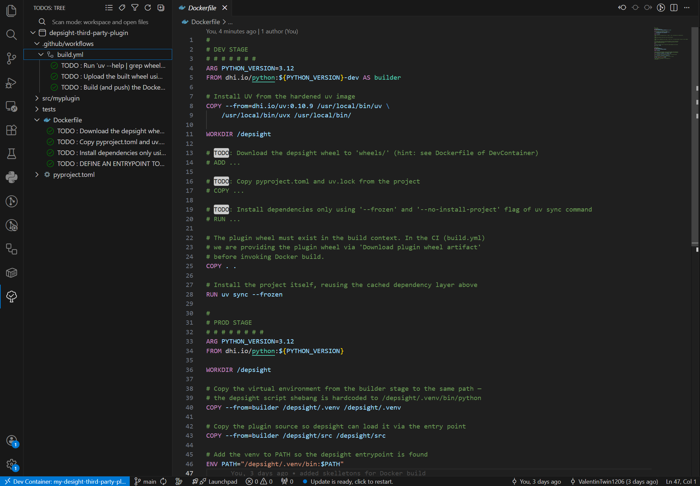

# Task 3: Package and Publish Your Plugin

## Task

With a working [dependency scan](./task-2-scan-dependencies.md) in place, your NPM plugin is ready for distribution. Your final task is to **create a Python wheel and a container image** to make the plugin portable and easy to deploy on any workstation.

## Hints

### Prerequisites: Docker Hub Repository and Credentials

Before running the workflow, make sure you have [created a Docker Hub repository and configured your Docker credentials as GitHub Secrets and Variables](./../getting-started/getting-started.md#set-up-your-docker-depsight-npm-plugin-repository) as described in the Getting Started guide. Publishing the Python wheel to a GitHub release requires no credentials, but publishing the container image to DockerHub does.

### Inline TODOs

The template repository already includes a `Dockerfile` and a GitHub Actions workflow script `build.yml`. Follow the inline `TODO` statements in both files to complete them. The expected outcome is a container image published to [DockerHub](https://hub.docker.com) and a Python wheel attached to a `1.0.0` release on your GitHub repository.

