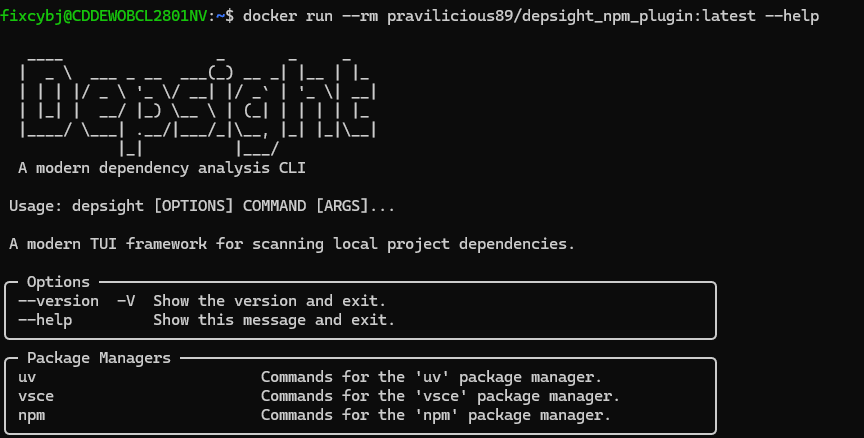

# Task 3: Scan Dependencies

## Task

With an [OCI image in place](./task-2-package-and-publish-your-plugin.md), the `depsight` application should be easy accessible on any workstation that hosts a container manager.



Your final task is to **scan the project dependencies** of the target ['fancy-fileserver'](https://github.com/ValentinTwin1206/fancy-fileserver) project using the built-in plugin `vsce` and your third-party plugin `npm`. Run a dependency scan with each plugin individually. Both plugins support the `--as-csv` option to export the discovered dependencies as a CSV file. You have to use this option for each scan so you end up with two separate CSV exports, one per plugin.


## Hints

### Download your OCI image

Simply use the `docker` cli to download your Depsight OCI image:

```bash
docker pull {YOUR_USERNAME}/depsight_npm_plugin:latest
```

### Download Fancy Fileserver Project

You can download the Fance Fileserver project with following command:

```bash
git clone https://github.com/ValentinTwin1206/fancy-fileserver.git
```

### Execute Depsight inside the Container

Your Depsight container should provide `depsight` as its entry-point, thus, following command should display the general help message:

```bash
docker run --rm {YOUR_USERNAME}/depsight_npm_plugin:latest --help
```