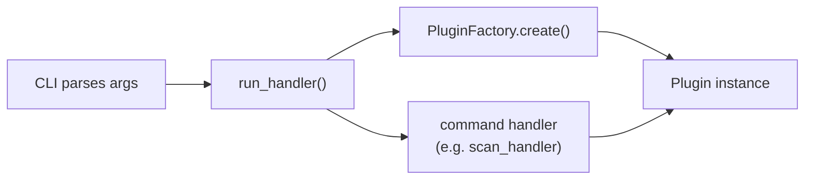

# Command-Line Interface

Depsight is a **command-line application** — it has no graphical window, no web dashboard, and no REST API. Users interact with it entirely through a terminal. This page explains what a CLI is, why Depsight chose one, and how the interface is built.

---

## What Is a CLI?

A command-line interface accepts text commands from a terminal emulator and returns text output. The user types a program name followed by arguments and options, and the program responds with results, errors, or status messages — all in plaintext or styled terminal output:

```
$ depsight uv scan --project-dir /my-project --verbose
```

Unlike graphical applications, a CLI is inherently composable: its output can be piped into other programs, it can be invoked from shell scripts, and it can be called from CI/CD pipelines without any special setup.

### Why a CLI for Depsight?

Depsight analyses dependency files and produces structured results. That workflow maps naturally to a command-line tool:

| Concern | CLI fit |
|---------|---------|
| **Automation** | CI pipelines call `depsight uv scan` directly — no browser or GUI driver needed |
| **Portability** | Runs in any terminal: local machines, DevContainers, SSH sessions, CI runners |
| **Composability** | Output can be piped to `grep`, `jq`, or exported to CSV with `--as-csv` |
| **Low overhead** | No server to start, no port to bind, no frontend to bundle |

---

## Libraries

Building a CLI from scratch — parsing arguments, validating types, printing help text, handling errors — is tedious and error-prone. Depsight delegates all of this to two libraries:

### Click

[Click](https://click.palletsprojects.com/) is a Python library for building command-line interfaces through decorated functions. Instead of manually parsing `sys.argv`, a developer decorates a function and Click handles argument parsing, type conversion, help generation, and error reporting:

```python
import click

@click.command()
@click.option("--name", required=True, help="Your name.")
def greet(name):
    """Say hello."""
    click.echo(f"Hello, {name}!")
```

Running `python greet.py --help` produces formatted help text automatically. Click also supports **command groups** — a top-level entry point with multiple subcommands — which is how Depsight structures its plugin-based CLI.

### Rich and rich-click

Terminal output does not have to be plain text. [Rich](https://rich.readthedocs.io/) is a Python library that renders styled text, tables, progress bars, and tree views directly in the terminal using ANSI escape codes. It works in every modern terminal emulator without any external dependencies.

[rich-click](https://github.com/ewels/rich-click) is a drop-in wrapper around Click that replaces Click's default help rendering with Rich-powered output — coloured headings, styled option tables, and syntax-highlighted usage lines — without changing any application logic.

Depsight uses `rich-click` as its Click import:

```python
import rich_click as click
```

This single import swap gives every `--help` screen Rich formatting. The scan command's table output is rendered with Rich's `Table` widget directly.

---

## Depsight's CLI Structure

### Entry Point

The CLI entry point is registered in `pyproject.toml`:

```toml
[project.scripts]
depsight = "depsight.cli:main"
```

After installation, typing `depsight` in a terminal calls the `main()` function in `cli.py`.

### Command Hierarchy

Depsight uses a two-level command hierarchy. The top-level group is `depsight`, and each plugin registers itself as a **subgroup** with its own commands:

```
depsight
├── uv
│   └── scan --project-dir <path> [--verbose] [--as-csv]
└── vsce
    └── scan --project-dir <path> [--verbose] [--as-csv]
```

This structure is generated dynamically at import time — the CLI iterates over every plugin in the registry and creates a Click group for each one:

```python
for plugin_name in SUPPORTED_PLUGINS:
    _register_plugin(plugin_name)
```

When a third-party plugin is installed (e.g. `depsight-npm`), it appears in the registry automatically and gets its own subcommand group without any changes to the Depsight codebase.

### The Run Handler

Commands do not instantiate plugins themselves. Instead, every command delegates to `run_handler()`, which acts as a **dispatcher**:



1. The CLI collects the parsed options into a dict and calls `run_handler()`
2. `run_handler()` uses the `PluginFactory` to create the correct plugin instance
3. The handler function receives the plugin and executes the command logic
4. The exit code (`0` for success, `1` for failure) is returned to the shell

This separation means command handlers never depend on Click directly — they receive a plugin, a path, and a logger, making them straightforward to test without simulating a terminal.

---

## Styling

Depsight defines a consistent colour scheme for all terminal output:

| Token | Colour | Usage |
|-------|--------|-------|
| `COLOR_DIM_ORANGE` | `#CD853F` (peru) | Commands, headings, table borders |
| `COLOR_PEACH` | `#FFDAB9` (peach-puff) | Arguments, options, highlighted values |

These colours are applied to the CLI help screens via `rich-click` style constants, and to the scan output table via Rich's styling API. The result is a visually consistent interface across all commands and outputs.

### Banner

The CLI prints an ASCII art banner on `--help`:

```
  ____                 _       _     _
 |  _ \  ___ _ __  ___(_) __ _| |__ | |_
 | | | |/ _ \ '_ \/ __| |/ _` | '_ \| __|
 | |_| |  __/ |_) \__ \ | (_| | | | | |_
 |____/ \___| .__/|___/_|\__, |_| |_|\__|
            |_|          |___/
 A modern dependency analysis CLI
```

This is defined as a Rich-markup string in `constants.py` and set as the `HEADER_TEXT` for rich-click.
