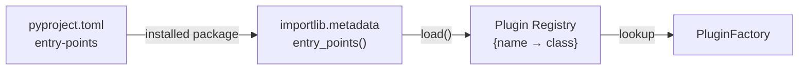
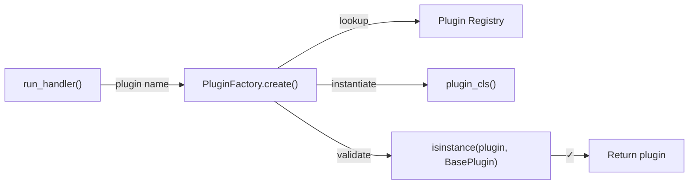
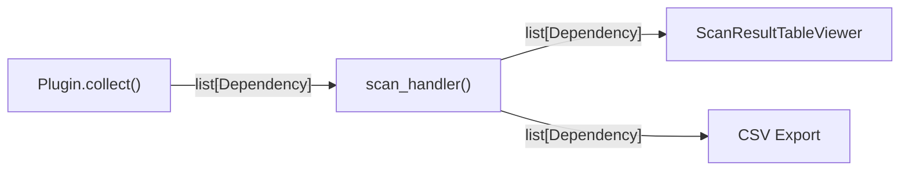

# Design Patterns

Depsight is built around a small set of design patterns that keep the codebase modular and extensible. This page covers the three core patterns: the **Plugin pattern** for extensibility, the **Factory pattern** for object creation, and the **Dataclass pattern** for structured data.

---

## Plugin Pattern

The plugin pattern allows a system to be extended without modifying its core code. Instead of hard-coding support for every package manager, Depsight defines a **contract** that any plugin must satisfy, and then discovers conforming implementations at runtime.

### Why Plugins?

Without a plugin system, adding support for a new package manager (say, npm) would mean editing multiple files in the Depsight core: the CLI, the run handler, the factory, and possibly the scan handler. Every new addition increases coupling and makes the codebase harder to maintain.

With the plugin pattern, the core never changes. A new package manager is a self-contained module that implements a known interface and registers itself via an entry point. The core discovers it automatically.

### The Contract — BasePlugin Protocol

Depsight defines the plugin contract as a **Protocol** ([PEP 544](https://peps.python.org/pep-0544/)) rather than an abstract base class:

```python
from typing import Protocol, runtime_checkable

@runtime_checkable
class BasePlugin(Protocol):
    dependencies: list[Dependency]

    @property
    def name(self) -> str: ...

    def collect(self, path: str | Path) -> None: ...

    def export(self, project_dir: str | Path, output_dir: str | Path) -> Path: ...
```

A Protocol uses **structural subtyping** (also known as duck typing) — any class that has the right attributes and methods satisfies the protocol, regardless of whether it explicitly inherits from `BasePlugin`. This is the same concept behind Python's built-in protocols: any object with an `__iter__` method is iterable, whether or not it inherits from `Iterable`.

The `@runtime_checkable` decorator allows `isinstance()` checks at runtime, which the factory uses to validate plugins after instantiation.

| Member | Purpose |
|--------|---------|
| `dependencies` | List populated by `collect()` — the discovered dependencies |
| `name` | Canonical identifier (e.g. `"uv"`, `"vsce"`) |
| `collect(path)` | Parse dependency files at `path` and populate `self.dependencies` |
| `export(...)` | Write `self.dependencies` to CSV and return the file path |

### Entry-Point Discovery

Plugins register themselves as Python **entry points** in `pyproject.toml`:

```toml
[project.entry-points."depsight.plugins"]
uv   = "depsight.core.plugins.uv.uv:UVPlugin"
vsce = "depsight.core.plugins.vsce.vsce:VSCEPlugin"
```

At startup, `discover_plugins()` queries the `depsight.plugins` entry-point group and builds a name-to-class registry:

```python
def discover_plugins(app_name: str) -> dict:
    registry: dict[str, type] = {}
    entry_points = importlib.metadata.entry_points(group=f"{app_name}.plugins")
    for ep in entry_points:
        plugin_cls = ep.load()
        registry[ep.name] = plugin_cls
    return registry
```



This mechanism is not specific to Depsight — it is the standard Python packaging convention for plugin systems. A third-party package can register a plugin by declaring an entry point in its own `pyproject.toml` under the `depsight.plugins` group. The plugin appears in the registry automatically at the next application start, with no changes to the Depsight codebase.

### Built-in Plugins

Depsight ships with two built-in plugins:

**UVPlugin** — parses `uv.lock` files (TOML format) to extract Python dependencies:

1. Locate `uv.lock` in the project directory
2. Parse with `tomllib` and iterate over `[[package]]` sections
3. Identify the editable package block (the project itself)
4. Classify dependencies as **prod** (runtime) or **dev** (optional/dev-dependency groups)
5. Extract version constraints from `metadata.requires-dist`

**VSCEPlugin** — parses `devcontainer.json` files to extract VS Code extension dependencies:

1. Walk the project directory for all `devcontainer.json` files
2. Strip single-line JSONC comments and parse as JSON
3. Read extensions from `customizations.vscode.extensions`
4. Create a `Dependency` per extension with `category="dev"`

---

## Factory Pattern

The Factory pattern centralises object creation behind a single method, decoupling the caller from the concrete class being instantiated. In Depsight, the caller (the run handler) knows it needs *a plugin* — but it does not know or care which specific class to instantiate.

### PluginFactory

```python
class PluginFactory:
    @staticmethod
    def create(plugin_name: str) -> BasePlugin:
        plugin_cls = SUPPORTED_PLUGINS.get(plugin_name)
        if plugin_cls is None:
            raise ValueError(
                f"Unknown plugin '{plugin_name}'. "
                f"Available: {', '.join(SUPPORTED_PLUGINS)}"
            )

        plugin = plugin_cls()

        if not isinstance(plugin, BasePlugin):
            raise TypeError(
                f"Plugin '{plugin_name}' ({plugin_cls.__qualname__}) "
                "does not implement BasePlugin."
            )

        return plugin
```

The factory performs three steps:

1. **Lookup** — finds the plugin class in the registry by name
2. **Instantiation** — calls the class constructor
3. **Validation** — checks that the instance satisfies the `BasePlugin` protocol at runtime



### Why a Factory?

Without the factory, the run handler would contain a chain of `if`/`elif` statements mapping names to classes — a pattern that must be updated every time a plugin is added. The factory replaces this with a registry lookup, making the creation logic open for extension but closed for modification.

The validation step catches a subtle failure mode: a third-party plugin that declares an entry point but does not implement the required interface.

---

## Dataclass Pattern

Python's `@dataclass` decorator auto-generates `__init__`, `__repr__`, and `__eq__` methods from class-level type annotations. This eliminates boilerplate while keeping the data structure explicit and type-checked.

### The Dependency Dataclass

Every plugin produces a list of `Dependency` instances — the shared schema for all dependency data in Depsight:

```python
from dataclasses import dataclass
from typing import Literal

type packageType = Literal["dev", "prod"]

@dataclass(slots=True)
class Dependency:
    name: str
    version: str | None = None
    constraint: str | None = None
    tool_name: str | None = None
    registry: str | None = None
    file: str | None = None
    category: packageType = "prod"
```

| Field | Example | Description |
|-------|---------|-------------|
| `name` | `"click"` | Package or extension identifier |
| `version` | `"8.3.1"` | Resolved version from the lockfile |
| `constraint` | `">=8.1.7"` | Version specifier from the project manifest |
| `tool_name` | `"uv"` | Which plugin discovered it |
| `registry` | `"https://pypi.org/simple"` | Package registry URL |
| `file` | `"/project/uv.lock"` | Source file path |
| `category` | `"dev"` or `"prod"` | Dependency classification |

### Why a Dataclass?

The alternative is a plain `dict`. Dicts are flexible, but they have no schema — a typo in a key name silently creates a new entry, missing fields cause `KeyError` at runtime (often far from where the dict was created), and there is no way for a type checker to verify correctness.

A dataclass makes the schema explicit:

```python
# Dict — no safety net
dep = {"name": "click", "vesion": "8.3.1"}   # typo: "vesion" — no error
print(dep["version"])                          # KeyError at runtime

# Dataclass — caught immediately
dep = Dependency(name="click", vesion="8.3.1")  # TypeError: unexpected keyword argument
```

The `slots=True` argument generates `__slots__` instead of using `__dict__`, which reduces memory usage per instance — a relevant optimization when a lockfile contains hundreds of dependencies.

### How It Flows Through the System

The `Dependency` dataclass is the common currency between plugins and commands:



Plugins produce `Dependency` instances. Command handlers consume them. Because both sides agree on the same dataclass, there is no serialisation or mapping step in between — the objects flow directly from producer to consumer.
