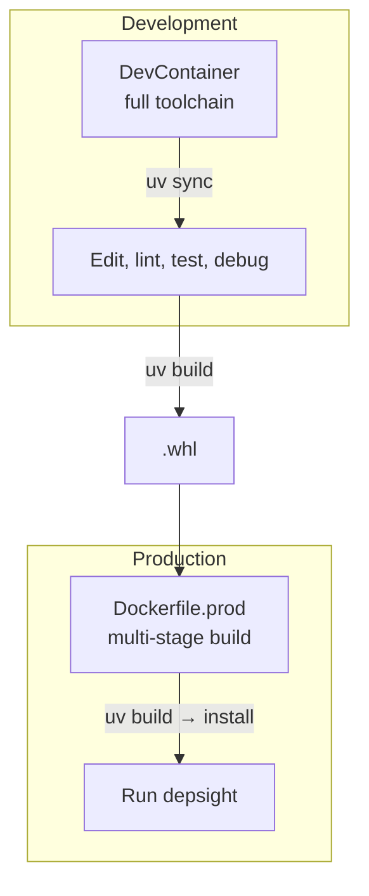

# Containerization

While the development environment runs inside a **DevContainer** (see the [DevContainers](../environment/devcontainer.md) page), the production deployment uses a separate, minimal Docker image purpose-built for running Depsight. This page covers why a dedicated production image is needed, how it is structured, and how to build and run it.

---

## Why a Separate Image?

The DevContainer image includes everything a developer needs: editors, linters, debuggers, documentation tools, and a full shell environment. That is exactly what makes it unsuitable for production — every extra tool is an extra attack surface, extra disk space, and extra startup time.

A production image has a different goal: **run Depsight and nothing else**.

| Concern | DevContainer | Production image |
|---------|-------------|-----------------|
| **Base image** | Microsoft DevContainer base (`mcr.microsoft.com/devcontainers/python`) | Official Python slim (`python:3.12-slim`) |
| **Size** | ~1 GB+ | ~150 MB |
| **Installed tools** | zsh, git, curl, sudo, pipx, ruff, mypy, pytest, mkdocs, ... | Python, uv, Depsight |
| **User** | `vscode` with `sudo` | Non-root `depsight` — no `sudo` |
| **Purpose** | Development and CI | Running `depsight` commands |

---

## Dockerfile

The production Dockerfile uses a **multi-stage build** to keep the final image small. The first stage installs the build toolchain and produces a wheel; the second stage installs only the wheel and its runtime dependencies.

```dockerfile
# ── Stage 1: Build ──────────────────────────────────────────
FROM python:3.12-slim AS builder

# Install uv
COPY --from=ghcr.io/astral-sh/uv:latest /uv /usr/local/bin/uv

WORKDIR /build
COPY pyproject.toml uv.lock ./
COPY src/ src/

# Build the wheel
RUN uv build --wheel --out-dir /dist

# ── Stage 2: Runtime ────────────────────────────────────────
FROM python:3.12-slim

# Install uv for fast dependency resolution
COPY --from=ghcr.io/astral-sh/uv:latest /uv /usr/local/bin/uv

# Non-root user
RUN groupadd --gid 1000 depsight && \
    useradd --uid 1000 --gid 1000 --shell /bin/sh --create-home depsight

WORKDIR /app

# Install the wheel and its dependencies
COPY --from=builder /dist/*.whl /tmp/
RUN uv pip install --system /tmp/*.whl && \
    rm -rf /tmp/*.whl

USER depsight

ENTRYPOINT ["depsight"]
```

### Stage 1 — Builder

The builder image starts from the full `python:3.12-slim`, copies in the project source and lockfile, and runs `uv build --wheel`. The resulting `.whl` file lands in `/dist`. Nothing from this stage — no source code, no build tools — makes it into the final image.

### Stage 2 — Runtime

The runtime image starts fresh from `python:3.12-slim`, copies `uv` for fast installation, creates a non-root `depsight` user, and installs the wheel built in stage 1. The entry point is set to `depsight`, so running the container directly executes the CLI:

```bash
docker run --rm depsight uv scan --project-dir /project
```

---

## Building the Image

```bash
# Build the production image
docker build -t depsight:latest -f Dockerfile.prod .

# Verify it works
docker run --rm depsight:latest --help
```

### Build Arguments

The Dockerfile accepts build arguments to pin versions:

```bash
docker build \
  --build-arg PYTHON_VERSION=3.12 \
  -t depsight:0.1.0 \
  -f Dockerfile.prod .
```

---

## Running the Container

Depsight analyses files on disk, so the project directory must be mounted into the container:

```bash
docker run --rm \
  -v "$(pwd)":/project:ro \
  depsight:latest uv scan --project-dir /project
```

| Flag | Purpose |
|------|---------|
| `--rm` | Remove the container after exit |
| `-v "$(pwd)":/project:ro` | Mount the current directory read-only at `/project` |
| `uv scan --project-dir /project` | The Depsight command to run |

The `:ro` (read-only) flag ensures the container cannot modify the host's project files.

### CSV Export

To export scan results, mount a writable output directory:

```bash
docker run --rm \
  -v "$(pwd)":/project:ro \
  -v "$(pwd)/output":/output \
  depsight:latest uv scan --project-dir /project --as-csv
```

---

## Image Publishing

Production images can be pushed to a container registry — Docker Hub, GitHub Container Registry (GHCR), or a private registry — so that CI pipelines and deployment environments can pull them without building locally.

### GitHub Container Registry

```bash
# Tag for GHCR
docker tag depsight:0.1.0 ghcr.io/<owner>/depsight:0.1.0

# Push
docker push ghcr.io/<owner>/depsight:0.1.0
```

This step can be automated via GitHub Actions — after a release is published, the workflow builds the production image and pushes it to GHCR alongside the wheel artifact.

---

## DevContainer vs Production — Summary



The DevContainer is where the wheel is developed and tested. The production Dockerfile consumes that wheel to produce a minimal runtime image.
