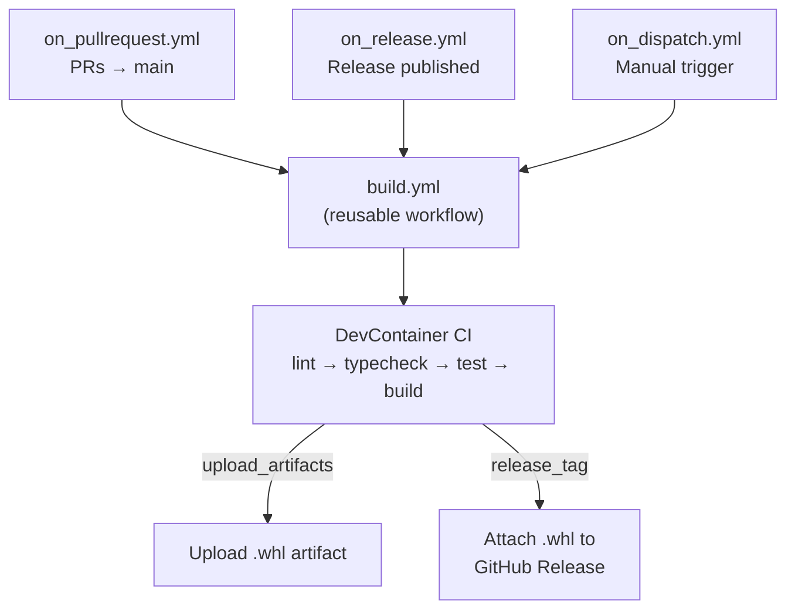
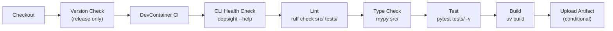
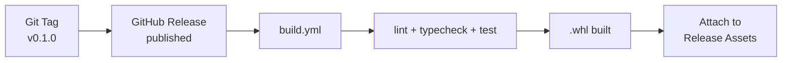

# GitHub Actions

Depsight uses **GitHub Actions** for continuous integration. All workflows run inside the project's DevContainer, guaranteeing that the CI environment matches the local development setup exactly. This page covers the workflow architecture, the reusable build pipeline, and the release flow.

---

## Overview

All workflows live in `.github/workflows/` and share a single reusable build workflow:



---

## Trigger Workflows

Each trigger workflow is a thin wrapper that calls the reusable `build.yml` with the appropriate inputs:

| Workflow | Trigger | Purpose |
|----------|---------|---------|
| `on_pullrequest.yml` | PR to `main` | Run checks on every pull request |
| `on_release.yml` | Release published | Build and attach wheel to the GitHub Release |
| `on_dispatch.yml` | Manual (Actions UI) | Ad-hoc builds with custom Python/uv versions |

Pull request builds ignore changes to documentation files and `README.md` to avoid unnecessary CI runs.

---

## Reusable Build Workflow

`build.yml` is the core pipeline, called by all trigger workflows. It accepts these inputs:

| Input | Default | Description |
|-------|---------|-------------|
| `python_version` | `3.12` | Python version for the container |
| `uv_version` | `0.10.9` | uv version to install |
| `release_tag` | — | Git tag to verify against `pyproject.toml` version |
| `upload_artifacts` | `false` | Whether to upload the wheel as a workflow artifact |

### Pipeline Steps

The pipeline runs inside the project's DevContainer using the [`devcontainers/ci`](https://github.com/devcontainers/ci) action:



**Inside the DevContainer**, the following commands run sequentially:

```bash
# Verify the CLI is functional
depsight --help

# Lint with ruff
ruff check src/ tests/

# Type-check with mypy
mypy src/

# Run the test suite
python -m pytest tests/ -v

# Build the wheel
uv build
```

### Version Verification

On release builds, the workflow compares the Git tag against the version in `pyproject.toml`. If they don't match, the build fails — preventing accidental version mismatches between what the code declares and what the release is labelled.

---

## Release Flow

When a GitHub Release is published, the full pipeline runs automatically:



1. A maintainer creates a Git tag (e.g. `v0.1.0`) and publishes a GitHub Release
2. `on_release.yml` triggers `build.yml` with the release tag
3. The pipeline verifies the tag matches `pyproject.toml`, runs all checks, and builds the wheel
4. The wheel is attached to the GitHub Release as a downloadable asset

Users can then install directly from the release:

```bash
pip install https://github.com/<owner>/depsight/releases/download/v0.1.0/depsight-0.1.0-py3-none-any.whl
```

---

## DevContainer CI

The key design decision is running CI inside the DevContainer rather than installing tools ad-hoc on a bare runner. This has two benefits:

1. **Environment parity** — the exact same image, tools, and configuration that developers use locally are used in CI. A test that passes on a developer's machine will pass in CI, and vice versa.
2. **No setup duplication** — tool versions, Python configuration, and system dependencies are defined once in the DevContainer and reused everywhere. There is no separate "CI setup" step that can drift out of sync.

The [`devcontainers/ci`](https://github.com/devcontainers/ci) action handles building and caching the DevContainer image on GitHub Actions runners.

---

## Summary

| Aspect | Tool / Approach |
|--------|----------------|
| **CI platform** | GitHub Actions |
| **CI environment** | DevContainer (identical to local dev) |
| **Workflow pattern** | Thin triggers → reusable `build.yml` |
| **Checks** | ruff (lint) → mypy (typecheck) → pytest (test) → uv build |
| **Distribution** | Python wheel attached to GitHub Release |
| **Version safety** | Git tag vs `pyproject.toml` version check |
