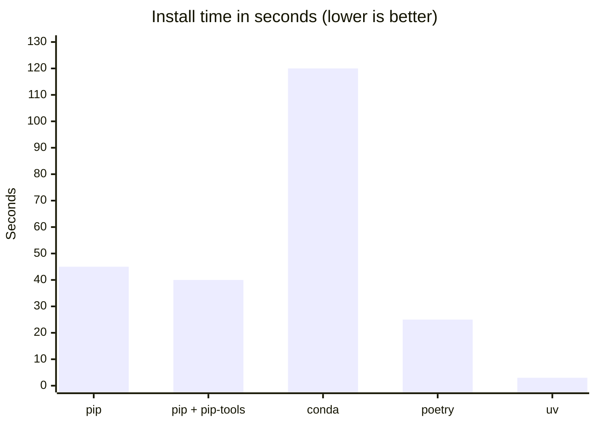
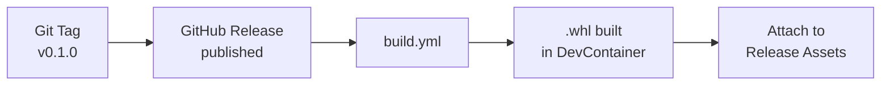

# Packaging

Depsight is distributed as a Python **wheel** — the standard binary distribution format for Python packages. This page covers what a wheel is, how to build one, and how it relates to the uv package manager.

---

## Python Wheels

A wheel (`.whl`) is a ZIP archive with a standardised layout. It contains the source code, package metadata, and entry-point declarations — everything an installer needs to place the package into a Python environment without running arbitrary build code.

### What's Inside a Wheel

```
depsight-0.1.0-py3-none-any.whl
├── depsight/
│   ├── __init__.py
│   ├── cli.py
│   ├── commands/...
│   ├── core/...
│   └── utils/...
└── depsight-0.1.0.dist-info/
    ├── METADATA          # Package name, version, dependencies
    ├── entry_points.txt  # CLI + plugin entry points
    └── RECORD            # File checksums
```

The `entry_points.txt` file registers both the CLI command and the plugin system:

```ini
[console_scripts]
depsight = depsight.cli:main

[depsight.plugins]
uv = depsight.core.plugins.uv.uv:UVPlugin
vsce = depsight.core.plugins.vsce.vsce:VSCEPlugin
```

After installation, the `depsight` command is available in the terminal, and the plugin registry can discover the built-in plugins through the `depsight.plugins` entry-point group.

### Build System

The build backend is **setuptools**, configured in `pyproject.toml`:

```toml
[build-system]
requires = ["setuptools>=61.0"]
build-backend = "setuptools.build_meta"
```

This tells any PEP 517-compliant build tool — `uv build`, `pip wheel`, or `python -m build` — which backend to invoke.

---

## Building With uv

Depsight uses [**uv**](https://docs.astral.sh/uv/) as its package manager. uv is written in Rust and designed as a drop-in replacement for pip and pip-tools, with a fast resolver, parallel downloads, and a proper lockfile workflow out of the box.

### Building Locally

```bash
# Build the wheel (outputs to dist/)
uv build
```

This produces two files:

```
dist/
├── depsight-0.1.0-py3-none-any.whl    # Wheel (binary distribution)
└── depsight-0.1.0.tar.gz              # Source distribution
```

### Installing the Wheel

```bash
# Install directly from the built wheel
pip install dist/depsight-0.1.0-py3-none-any.whl

# Or install in development mode (editable)
uv sync
```

### Lockfile

`uv sync` generates a `uv.lock` file that pins exact versions of every transitive dependency. This file is committed to version control so that every developer, every CI run, and every production build installs exactly the same packages:

```toml
[[package]]
name = "click"
version = "8.3.1"
source = { registry = "https://pypi.org/simple" }

[[package]]
name = "rich"
version = "13.9.4"
source = { registry = "https://pypi.org/simple" }
```

### Common Commands

```bash
# Install all dependencies (including dev and docs groups)
uv sync --all-groups

# Add a new runtime dependency
uv add <package>

# Add a dev dependency
uv add --group dev <package>

# Build a distributable wheel
uv build

# Run a command inside the managed environment
uv run depsight --help
```

### Why uv Over pip?

`pip` was built before lockfiles, dependency groups, or fast resolution were priorities. Installing a moderately sized project with pip can take tens of seconds due to serial network requests and a slow resolver. `uv` addresses all of this in a single binary:

- **Lockfile by default** — `uv sync` generates `uv.lock`, pinning every transitive dependency
- **Dependency groups** — dev and docs dependencies are first-class, defined in `pyproject.toml`
- **Speed** — the resolver and installer are written in Rust with parallel downloads and a shared cache



---

## Artifact Handling

### Workflow Artifacts

When `upload_artifacts` is enabled in a GitHub Actions manual dispatch, the built wheel is uploaded as a workflow artifact with a **14-day retention period**. This is useful for testing pre-release builds without publishing a formal release.

### Release Artifacts

When a GitHub Release is published, the workflow builds the wheel and attaches it directly to the release page. Users download the `.whl` file from the release assets.



---

## Version Verification

On release builds, the CI workflow compares the Git tag against the version in `pyproject.toml`. If they don't match, the build fails — preventing accidental version mismatches between what the code declares and what the release is labelled.
