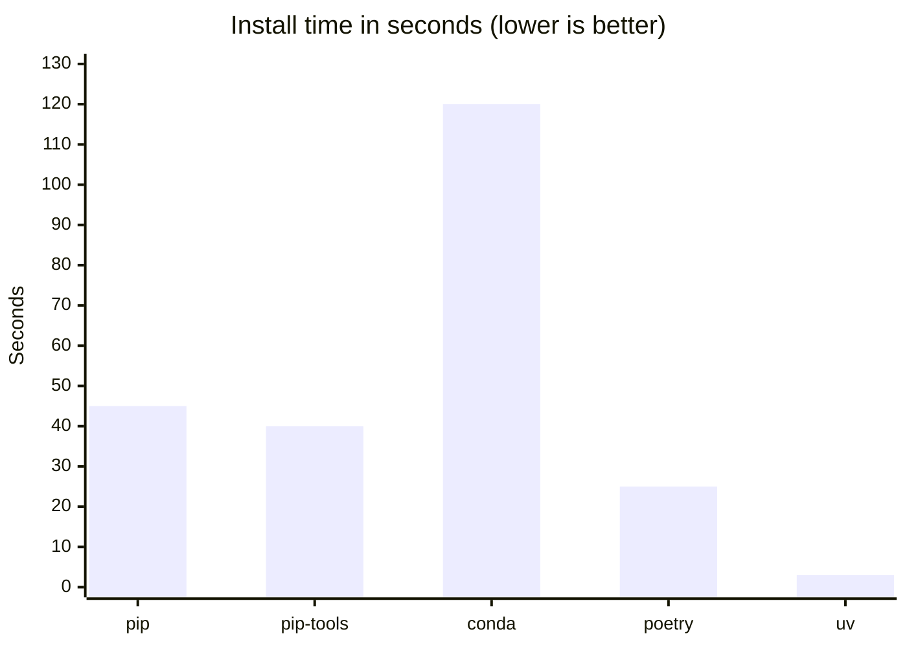
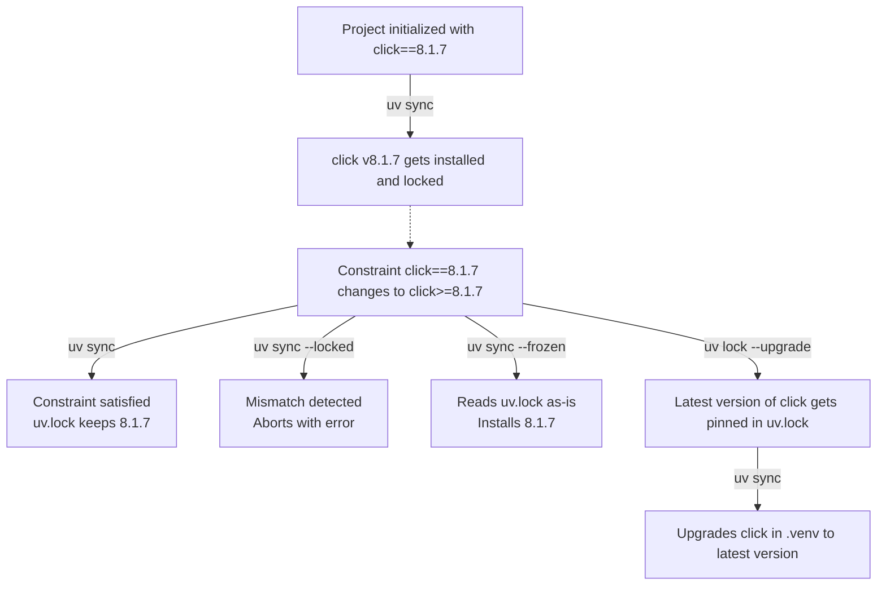

# Project Overview

## Overview

Setting up a Python project has changed significantly over the past two decades. What once required a fragmented mix of configuration files has since converged on a single standard with `pyproject.toml`. Alongside this consolidation, a new generation of developer tools has emerged that takes full advantage of the modern standard. Tools like [uv](https://docs.astral.sh/uv/) and [Ruff](https://docs.astral.sh/ruff/) enable a scalable and streamlined project setup with minimal configuration overhead.

Depsight embraces this modern stack. Metadata, dependencies, build system configuration, and tool settings all live in a single `pyproject.toml`, and `uv` manages the full dependency lifecycle from installation to publishing.

---

## Project Configuration

### Python Project Configuration in the Past

In 1998, `distutils` introduced `setup.py`, an imperative Python script that served as the build entry point for a project. Package metadata such as the `name`, `version`, and `description` were declared as function arguments inside executable code. A `requires` keyword existed for declaring dependencies, but it was purely informational metadata. No tool ever used it to download or install packages automatically; developers had to find, download, and install each dependency by hand.

=== "`setup.py`"
    ```python
    from distutils.core import setup

    setup(
        name="my-package",
        version="1.0.0",
        description="A sample package",
        requires=[
            "lxml (>=0.9)",
        ],
    )
    ```

Around 2004, `setuptools` extended `setup.py` with automatic package discovery and replaced the inert `requires` with `install_requires`, which actually caused dependencies to be resolved and installed. Metadata, however, remained executable Python code. Consequently, any tool had to run the file just to read the package name or version, which was both a security risk and a barrier to static tooling.

=== "`setup.py`"
    ```python
    from setuptools import setup, find_packages

    setup(
        name="my-package",
        version="2.0.0",
        description="A sample package",
        packages=find_packages(),
        install_requires=[
            "lxml>=1.0",
        ],
    )
    ```

In 2008, `pip` was released and introduced `requirements.txt` as a convention for pinning exact dependency versions alongside the existing `setup.py`. Some teams also started maintaining a separate `requirements-dev.txt` for development tools like test runners and linters, which meant keeping multiple files in sync manually.

=== "`setup.py`"

    ```python
    from setuptools import setup, find_packages

    setup(
        name="my-package",
        version="3.0.0",
        description="A sample package",
        packages=find_packages(),
        install_requires=[
            "lxml>=1.0",
        ],
    )
    ```

=== "`requirements.txt`"

    ```text
    lxml==1.3.6
    ```

=== "`requirements-dev.txt`"

    ```text
    pytest==2.3.5
    ```

In late 2016, `setuptools 30.3` introduced full support for declarative metadata in `setup.cfg`, moving all package metadata out of executable Python code and into a static configuration file. Runtime dependencies could be declared under `[options] install_requires`, and development extras under `[options.extras_require]`, installable via `pip install -e ".[dev]"`.

However, the entries under `install_requires` and `extras_require`only expressed loose constraints and did not pin exact versions. A separate `requirements.txt` (and `requirements-dev.txt`) was therefore still maintained alongside `setup.cfg` to lock exact versions for reproducible installs. And despite all of this, `setup.py` was still required because `pip` internally depended on it. Consequently, removing it would cause installs to fail entirely:

=== "`pip`"

    ```
    $ pip install -e .
    Obtaining file:///{PATH_TO_PROJECT_ROOT}/my-package
    ERROR: file:///{PATH_TO_PROJECT_ROOT}/my-package does not appear to be a Python project: neither 'setup.py' nor 'pyproject.toml' found.
    ```

=== "`uv`"

    ```
    $ uv sync
    error: No `pyproject.toml` found in current directory or any parent directory
    ```

Projects therefore had to keep `setup.cfg`, `setup.py`, `requirements.txt`, and `requirements-dev.txt` in sync manually.

=== "`setup.cfg`"

    ```ini
    [metadata]
    name = my-package
    version = 4.0.0
    description = A sample package

    [options]
    packages = find:
    install_requires =
        lxml>=3.0

    [options.extras_require]
    dev =
        pytest>=3.2
    ```

=== "`setup.py`"

    ```python
    from setuptools import setup
    setup()
    ```

=== "`requirements.txt`"

    ```text
    lxml==3.6.4
    ```

=== "`requirements-dev.txt`"

    ```text
    pytest==3.2.3
    ```

### Python Project Configuration Nowadays

#### Single Source of True

In 2016 the fragmentation of project configuration across several files ended, since [PEP 517](https://peps.python.org/pep-0517/) and [PEP 518](https://peps.python.org/pep-0518/) introduced `pyproject.toml` as a standard home for build system metadata. [PEP 621](https://peps.python.org/pep-0621/) completed the picture in 2020 by standardising the `[project]` table for package metadata.

The `[project]` table consolidates everything that used to live across `setup.py` and `setup.cfg`. It declares the package name, version, description, and a `dependencies` list that serves as the canonical declaration of runtime requirements, replacing `requirements.txt`. The `[build-system]` table specifies the backend responsible for assembling the project into a distributable artifact. The `[dependency-groups]` table takes care of development and documentation tooling separately from runtime requirements, replacing scattered `requirements-dev.txt` files with a structured, first-class concept inside the same file. Finally, `[tool.*]` sections configure linters, formatters, and test runners directly in `pyproject.toml`, removing the need for separate files such as `.flake8` or `pytest.ini`.

#### Project Orchestration

With `pyproject.toml` as a stable foundation, the Python ecosystem now has the same capability as other languages (e.g. `npm`, `cargo`, `go mod`) to orchestrate the entire project lifecycle around a single central configuration file.

Tools such as [Poetry](https://python-poetry.org/) and [uv](https://docs.astral.sh/uv/) expose a clean CLI covering project initialization (`uv init` / `poetry new`), dependency management (`uv add` / `poetry add`), environment synchronization (`uv sync`) as well as building (`uv build` / `poetry build`), and publishing (`uv publish` / `poetry publish`) Python packages.

##### Project Initialization

Both tools scaffold a PEP 621-compliant `pyproject.toml` from a single command and support various flags to customise the output layout, Python version, package name, or build backend:

=== "`uv`"

    Following command scaffolds a new project in the `my-uv-package` directory:

    - The `--name "hello"` decouples the package name from the folder name
    - The `--build-backend "uv"` flag selects `uv_build` as the build backend
    - The `--app` flag requests an application-oriented project  with a `src` layout

    ```bash
    uv init my-uv-package --name "hello" --build-backend "uv" --app
    ```

    The resulting project directory after running `uv init`:

    ```
    my-uv-package/
    ├── .git/
    ├── .gitignore
    ├── .python-version
    ├── README.md
    ├── pyproject.toml
    └── src
        └── hello
            └── __init__.py  
    ```

    The generated `pyproject.toml` uses `uv_build` as the build backend:

    ```toml
    [project]
    name = "hello"
    version = "0.1.0"
    description = "Add your description here"
    readme = "README.md"
    authors = [
        { name = "ValentinTwin1206", email = "vpravtchev@gmail.com" }
    ]
    requires-python = ">=3.12"
    dependencies = []

    [project.scripts]
    hello = "hello:main"

    [build-system]
    requires = ["uv_build>=0.11.1,<0.12.0"]
    build-backend = "uv_build"
    ```

=== "`poetry`"

    Following command scaffolds a new project in the `my-poetry-package` directory:

    - The `--name "hello"` flag decouples the package name from the folder name
    - Poetry already creates a package-oriented project with a `src` layout by default
    - Poetry uses `poetry-core` as its build backend by default

    ```bash
    poetry new my-poetry-package --name "hello"
    ```

    The resulting project directory after running `poetry new`:

    ```
    my-poetry-package/
    ├── README.md
    ├── pyproject.toml
    ├── src/
    │   └── my_package/
    │       └── __init__.py
    └── tests/
        └── __init__.py
    ```

    The generated `pyproject.toml` uses `poetry.core.masonry.api` as the build backend:

    ```toml
    [project]
    name = "hello"
    version = "0.1.0"
    description = ""
    authors = [
        {name = "ValentinTwin1206",email = "vpravtchev@gmail.com"}
    ]
    readme = "README.md"
    requires-python = ">=3.12"
    dependencies = [
    ]

    [tool.poetry]
    packages = [{include = "hello", from = "src"}]

    [build-system]
    requires = ["poetry-core>=2.0.0,<3.0.0"]
    build-backend = "poetry.core.masonry.api"
    ```

##### Dependency Installation

The `hello` project can further be extended by adding runtime dependencies by using uv's and Poetry's `add` command. The following examples installs the [click](https://github.com/pallets/click) library which is a popular framework for building command-line interfaces. Since `click` only depends on `colorama` on Windows, it also serves as a useful starting point for out later understanding how [lockfiles](#lockfile) capture transitive dependencies.

=== "`uv`"

    Following command installs the `click` library:

    ```bash
    cd my-uv-package
    uv add click==8.1.7
    ```

    In addition to updating `pyproject.toml`, uv resolves the full dependency graph, writes a `uv.lock` lockfile, and creates a Python venv `.venv` that is kept automatically in sync:

    ```
    my-uv-package/
    ├── .git/
    ├── .gitignore
    ├── .python-version
    ├── .venv
    ├── README.md
    ├── pyproject.toml
    ├── src
    │   └── hello
    │       └── __init__.py  
    └── uv.lock
    ```

    The generated `pyproject.toml` declares `click` as a runtime dependency:

    ```toml
    [project]
    name = "hello"
    version = "0.1.0"
    description = "Add your description here"
    readme = "README.md"
    authors = [
        { name = "{GIT_NAME}", email = "{GIT_MAIL}" }
    ]
    requires-python = ">=3.12"
    dependencies = [
        "click==8.1.7",
    ]

    [project.scripts]
    hello = "hello:main"

    [build-system]
    requires = ["uv_build>=0.11.1,<0.12.0"]
    build-backend = "uv_build"
    ```

=== "`poetry`"

    Following command installs the `click` library:
    
    ```bash
    cd my-poetry-package
    poetry add click
    ```

    In addition to updating `pyproject.toml`, Poetry resolves the full dependency graph and writes a `poetry.lock` lockfile:

    ```
    my-poetry-package/
    ├── README.md
    ├── poetry.lock
    ├── pyproject.toml
    ├── src/
    │   └── my_package/
    │       └── __init__.py
    └── tests/
        └── __init__.py
    ```

    Note that the generated `pyproject.toml` declares `click` as a runtime dependency under `[tool.poetry.dependencies]` rather than the standard PEP 621 `"dependencies"` list:

    ```toml
    [project]
    name = "hello"
    version = "0.1.0"
    description = ""
    authors = [
        { name = "{GIT_NAME}", email = "{GIT_MAIL}" }
    ]
    readme = "README.md"
    requires-python = ">=3.12"

    [tool.poetry]
    packages = [{include = "hello", from = "src"}]

    [tool.poetry.dependencies]
    click = "8.1.7"

    [build-system]
    requires = ["poetry-core>=2.0.0,<3.0.0"]
    build-backend = "poetry.core.masonry.api"
    ```

##### Running the Project

The following `__init__.py` uses `click` to define a minimal CLI command. It accepts an optional `--name` argument and prints a greeting to the terminal:

```python
# __init__.py
import click

@click.command()
@click.option("--name", default="World", help="Name to greet.")
def main(name):
    click.echo(f"Hello, {name}!")

if __name__ == "__main__":
    main()
```

The following patterns show how to bootstrap the project environment and run the CLI for each tool:

=== "`uv`"

    Activate the virtual environment that `uv` created automatically, then run the CLI:

    ```bash
    source .venv/bin/activate
    uv run src/hello/__init__.py --name Alice
    ```

=== "`poetry`"

    Poetry does not create a virtual environment automatically, so we create and activate one first, then install all declared dependencies into it:

    ```bash
    python3 -m venv .venv
    source .venv/bin/activate
    poetry install
    ```

    Run the CLI by passing the file to the `python` interpreter explicitly:

    ```bash
    poetry run python src/hello/__init__.py --name Alice
    ```

---

## Development Tools

### Build Management

Build management is the process of packaging Python source code into [distributable artifacts](./../integration_and_deployment/distribution.md#python-wheels). [PEP 517](https://peps.python.org/pep-0517/) defined a standard interface between build frontends and build backends. A build frontend is the tool the developer runs (e.g. `uv build`, `python -m build`) and orchestrates the build process. A build backend is the library that does the actual work of compiling metadata and assembling the wheel; it is declared in the `[build-system]` table in `pyproject.toml` and invoked by the frontend.

Depsight uses `uv_build` as its build backend, which has been a stable, PEP 517-compliant backend since uv `v0.7.19`. `uv_build` is shipped with `uv` but is not user-facing; `uv build` remains the command for normal use. The backend is declared in `pyproject.toml`:

```toml
[build-system]
requires = ["uv_build>=0.11.1,<0.12"]
build-backend = "uv_build"
```

#### Alternatives

The most widely adopted alternative is [Setuptools](https://pypi.org/project/setuptools/), which offers the broadest ecosystem compatibility and is a sensible default when tooling interoperability matters most. [Hatchling](https://pypi.org/project/hatchling/) is a modern option that reads all metadata directly from `pyproject.toml`, enforces standards compliance more strictly, and produces reproducible builds by default.

### Dependency Management

Dependency management is the process of declaring which third-party packages a project needs, resolving compatible versions, and installing them reproducibly across environments. As already introduced in [Project Orchestation](#project-orchestration), centralizing all dependency declarations in `pyproject.toml` significantly streamlines this process.

Depsight uses [**uv**](https://docs.astral.sh/uv/) as its package manager, a Rust-based tool that resolves and installs packages significantly faster than `pip` or any other Python dependency manager through parallel downloads and a shared global cache.



#### Synchronizing Dependencies

The `uv sync` command installs all **direct dependencies** declared in `pyproject.toml` at once, along with their full **transitive dependency graph**. On a clean checkout, uv generates a [lockfile](#lockfile) if one does not yet exist and provisions a virtual environment at `.venv/`. Any packages that have been downloaded before are served from uv's [global cache](#cache) rather than fetched from the network again, which makes repeated installs significantly faster. On subsequent runs, it detects any drift between `pyproject.toml` and the [lockfile](#lockfile) and reconciles them. The virtual environment is always kept in sync automatically, so developers can immediately work with the correct set of packages without any manual intervention.

The `uv sync` command provides a set of flags that must be chosen carefully according to the target environment and use case. They significantly change its behaviour — from a permissive local install that re-resolves freely, to a strict CI check that fails on any lockfile drift, to a fully frozen production deployment that never touches `pyproject.toml` at all:

=== "Local Development"

    ```bash
    # Install all dependencies and the project itself in editable mode
    uv sync

    # Also include an optional dependency-group (e.g. docs or lint)
    uv sync --group docs
    ```

=== "CI/CD (Verification)"

    ```bash
    # Install all groups and abort if uv.lock is out of sync with pyproject.toml
    # Ensures the lockfile was updated whenever dependencies changed
    uv sync --all-groups --locked
    ```

=== "CI/CD (Production deployment)"

    ```bash
    # Install from uv.lock as-is, skip dev dependencies, never check pyproject.toml
    # Fastest and most reproducible option for containerised deployments
    uv sync --frozen --no-dev
    ```

#### Updating Dependencies

Consider the [`hello` project](#dependency-installation) changed `click==8.1.7` to `click>=8.1.7` in `pyproject.toml` while `uv.lock` still pins `8.1.7`. Because the locked version still satisfies the loosened constraint, `uv sync` keeps installing `8.1.7`. To pull in a newer release explicitly, run `uv lock --upgrade-package click` followed by `uv sync`.



#### Lockfile

The `uv.lock` below is the direct result of running `uv add click==8.1.7` on the [`hello` project](#dependency-installation). Because the lockfile records exact versions and SHA-256 hashes for every package in the dependency graph, every developer, CI run, and deployment installs bit-for-bit identical packages regardless of when or where `uv sync` is executed.

Like every dependency manager, uv uses its own proprietary lockfile format, making toolchain migrations a breaking change. [PEP 751](https://peps.python.org/pep-0751/) introduced `pylock.toml` as a standardised, tool-agnostic export format to address lockfile fragmentation across toolchains, but it is not a replacement for `uv.lock`. uv does not read `pylock.toml` back for any command or updating the project's venv, so replacing `uv.lock` with it would break the entire uv workflow. Its purpose is interoperability and auditing — for example, sharing a resolved dependency snapshot with a team that uses a different package manager. The `pylock.toml` below was generated by running `uv export --format pylock.toml > pylock.toml`.

=== "`uv.lock`"

    ```toml
    version = 1
    revision = 3
    requires-python = ">=3.12"

    [[package]]
    name = "click"
    version = "8.1.7"
    source = { registry = "https://pypi.org/simple" }
    dependencies = [
        { name = "colorama", marker = "sys_platform == 'win32'" },
    ]
    sdist = { url = "https://files.pythonhosted.org/packages/96/d3/f04c7bfcf5c1862a2a5b845c6b2b360488cf47af55dfa79c98f6a6bf98b5/click-8.1.7.tar.gz", hash = "sha256:ca9853ad459e787e2192211578cc907e7594e294c7ccc834310722b41b9ca6de", size = 336121, upload-time = "2023-08-17T17:29:11.868Z" }
    wheels = [
        { url = "https://files.pythonhosted.org/packages/00/2e/d53fa4befbf2cfa713304affc7ca780ce4fc1fd8710527771b58311a3229/click-8.1.7-py3-none-any.whl", hash = "sha256:ae74fb96c20a0277a1d615f1e4d73c8414f5a98db8b799a7931d1582f3390c28", size = 97941, upload-time = "2023-08-17T17:29:10.08Z" },
    ]

    [[package]]
    name = "colorama"
    version = "0.4.6"
    source = { registry = "https://pypi.org/simple" }
    sdist = { url = "https://files.pythonhosted.org/packages/d8/53/6f443c9a4a8358a93a6792e2acffb9d9d5cb0a5cfd8802644b7b1c9a02e4/colorama-0.4.6.tar.gz", hash = "sha256:08695f5cb7ed6e0531a20572697297273c47b8cae5a63ffc6d6ed5c201be6e44", size = 27697, upload-time = "2022-10-25T02:36:22.414Z" }
    wheels = [
        { url = "https://files.pythonhosted.org/packages/d1/d6/3965ed04c63042e047cb6a3e6ed1a63a35087b6a609aa3a15ed8ac56c221/colorama-0.4.6-py2.py3-none-any.whl", hash = "sha256:4f1d9991f5acc0ca119f9d443620b77f9d6b33703e51011c16baf57afb285fc6", size = 25335, upload-time = "2022-10-25T02:36:20.889Z" },
    ]

    [[package]]
    name = "hello"
    version = "0.1.0"
    source = { editable = "." }
    dependencies = [
        { name = "click" },
    ]

    [package.metadata]
    requires-dist = [{ name = "click", specifier = "==8.1.7" }]
    ```

=== "`pylock.toml`"

    ```toml
    lock-version = "1.0"
    created-by = "uv"
    requires-python = ">=3.12"

    [[packages]]
    name = "click"
    version = "8.1.7"
    index = "https://pypi.org/simple"
    sdist = { url = "https://files.pythonhosted.org/packages/96/d3/f04c7bfcf5c1862a2a5b845c6b2b360488cf47af55dfa79c98f6a6bf98b5/click-8.1.7.tar.gz", upload-time = 2023-08-17T17:29:11Z, size = 336121, hashes = { sha256 = "ca9853ad459e787e2192211578cc907e7594e294c7ccc834310722b41b9ca6de" } }
    wheels = [{ url = "https://files.pythonhosted.org/packages/00/2e/d53fa4befbf2cfa713304affc7ca780ce4fc1fd8710527771b58311a3229/click-8.1.7-py3-none-any.whl", upload-time = 2023-08-17T17:29:10Z, size = 97941, hashes = { sha256 = "ae74fb96c20a0277a1d615f1e4d73c8414f5a98db8b799a7931d1582f3390c28" } }]

    [[packages]]
    name = "colorama"
    version = "0.4.6"
    marker = "sys_platform == 'win32'"
    index = "https://pypi.org/simple"
    sdist = { url = "https://files.pythonhosted.org/packages/d8/53/6f443c9a4a8358a93a6792e2acffb9d9d5cb0a5cfd8802644b7b1c9a02e4/colorama-0.4.6.tar.gz", upload-time = 2022-10-25T02:36:22Z, size = 27697, hashes = { sha256 = "08695f5cb7ed6e0531a20572697297273c47b8cae5a63ffc6d6ed5c201be6e44" } }
    wheels = [{ url = "https://files.pythonhosted.org/packages/d1/d6/3965ed04c63042e047cb6a3e6ed1a63a35087b6a609aa3a15ed8ac56c221/colorama-0.4.6-py2.py3-none-any.whl", upload-time = 2022-10-25T02:36:20Z, size = 25335, hashes = { sha256 = "4f1d9991f5acc0ca119f9d443620b77f9d6b33703e51011c16baf57afb285fc6" } }]

    [[packages]]
    name = "hello"
    directory = { path = ".", editable = true }
    ```


#### Cache

uv maintains a shared, global package cache at `~/.cache/uv` on Linux and macOS (and `%LOCALAPPDATA%\uv\cache` on Windows). Its multi-layer architecture — interpreter metadata, HTTP metadata, extracted archives, and virtual environment links — is the primary reason `uv sync` is significantly faster than other package managers: on repeated runs, uv can skip the interpreter interrogation, the network request, and the extraction step entirely. Because each layer is content-addressed and keyed by package name, version, and wheel tag, different Python versions and platforms never collide in the same cache. Cache entries can be inspected and pruned with `uv cache dir`, `uv cache clean`, and `uv cache prune`. Again, consider the [`hello` project](#dependency-installation) with `click==8.1.7` locked in `uv.lock`.

```
~/.cache/uv/
├── archive-v0/
│   └── hme55N4OUvYG9esKH1cmH/                  ← extracted wheel contents
│       ├── click/
│       │   ├── __init__.py
│       │   └── ...
│       └── click-8.1.7.dist-info/
├── interpreter-v4/
│   └── 2599639d1b0af0a8/
│       └── 2ab6934b930fb655.msgpack        ← Python interpreter metadata
└── wheels-v6/
    └── pypi/
        └── click/
            └── click-8.1.7-py3-none-any.http   ← HTTP metadata & hash
                └── 8.1.7-py3-none-any -> ../../../../archive-v0/hme55N4O.../
```

- **Interpreter metadata (`interpreter-v4/`)** — Before resolving or installing anything, uv needs to know which Python interpreter to use. It caches the result of interrogating a Python binary in a MessagePack file (`.msgpack`) keyed by the interpreter path. This file records the interpreter version (`3.12.3`), platform details (`linux`, `x86_64`), and the `.venv` site-packages layout. On subsequent runs, uv reads this cache instead of spawning the interpreter again, which removes the startup overhead entirely.
- **HTTP metadata (`wheels-v6/`)** — Each wheel URL in `uv.lock` maps to a `.http` metadata file here. When `uv sync` runs, it generates a cache key from the wheel URL and checks whether the SHA-256 hash in `uv.lock` matches the cached metadata. If it does, uv knows the remote file has not changed and skips the network request to PyPI entirely.
- **Extracted archive (`archive-v0/`)** — When uv downloads a wheel for the first time, it does not just store the `.whl` file. It extracts the wheel contents into a content-addressed directory under `archive-v0/` and stores a symlink to it inside `wheels-v6/`. On subsequent installs, uv follows that symlink and finds the package ready to use without any extraction step.
- **Installation into `.venv` via hardlinks or reflinks** — uv links the pre-extracted files from `archive-v0/` directly into `.venv` without copying any bytes. On copy-on-write filesystems (Btrfs, XFS, APFS) it uses reflinks; on ext4 it falls back to hardlinks. Either way, no data is duplicated on disk and the install completes nearly instantaneously.

---

### Testing

Testing is the practice of executing code in a controlled way to verify that it behaves as intended and to catch regressions when the codebase changes. In Python, tests are usually written as regular Python functions that assert on expected behavior, which keeps the feedback loop simple and accessible. The ecosystem is centered around tools such as `pytest`, which handle discovery, fixtures, parametrization, and failure reporting.

Automated tests verify that the code behaves as expected and catch regressions before they reach other developers or production. Without a test runner, verifying correctness means manually re-running the application after every change — which does not scale and is error-prone. Depsight uses [pytest](https://docs.pytest.org/). A basic test looks like this:

```python
# tests/test_math.py
def add(a: int, b: int) -> int:
    return a + b

def test_add() -> None:
    assert add(2, 3) == 5
    assert add(-1, 1) == 0
```

Running `python -m pytest tests/` discovers and executes all `test_*` functions automatically.

---

### Code Quality Tools

#### Linter and Formatter

Linters and formatters improve source code quality before the program is ever run. In Python, this is especially valuable because the language emphasizes readability and has many style and correctness conventions that benefit from automatic enforcement. Modern Python tooling often combines import sorting, formatting, and static rule checking into a small number of fast commands that can run locally and in CI.

Depsight uses [Ruff](https://docs.astral.sh/ruff/) as its linter and formatter. Ruff is implemented in Rust and represents a modern consolidation of the Python tooling ecosystem. It is a full replacement of `flake8`, `isort`, and `black` in a single binary while being significantly faster than any of them. Rather than maintaining separate configuration files like `.flake8` or `tox.ini`, Ruff reads all its settings from `pyproject.toml` under `[tool.ruff]`, keeping the entire project configuration in one place. Running `ruff check` on the following code

```python
import os  # unused import
import sys

x=1+2      # missing whitespace around operator
print(x)
```

produces:

```
error[F401]: `os` imported but unused
error[E225]: missing whitespace around operator
```

Both issues are caught before the code is ever run or reviewed.

#### Type Checker

Type checking verifies that values are used consistently with their declared types, such as ensuring that a function expecting a `str` is not given an `int`. Python remains dynamically typed at runtime, but its type hint system has grown into a major part of modern development because it allows tools to analyze code statically before execution. In practice, Python type checkers improve refactoring safety, editor support, and API clarity, especially in larger projects and plugin-based architectures.

Depsight uses [mypy](https://mypy.readthedocs.io/) as its static type checker. Python is dynamically typed by default, which means type errors only surface at runtime. mypy analyses the code without running it and catches type mismatches, missing attributes, and incorrect function signatures before they can become runtime failures. It replaces the need for a standalone `mypy.ini` configuration file by reading its settings from `pyproject.toml` under `[tool.mypy]`. For a project like Depsight that exposes a plugin API, type annotations enforced by mypy also serve as living documentatio. Callers know exactly what a function expects and returns without having to read the implementation. Running `mypy` on the following code:

```python
def greet(name: str) -> str:
    return "Hello, " + name

result: int = greet("world")  # assigned to int, but greet returns str
print(result.upper())         # int has no upper() — runtime crash waiting to happen
```

produces:

```
error: Incompatible types in assignment (expression has type "str", variable has type "int")
```
