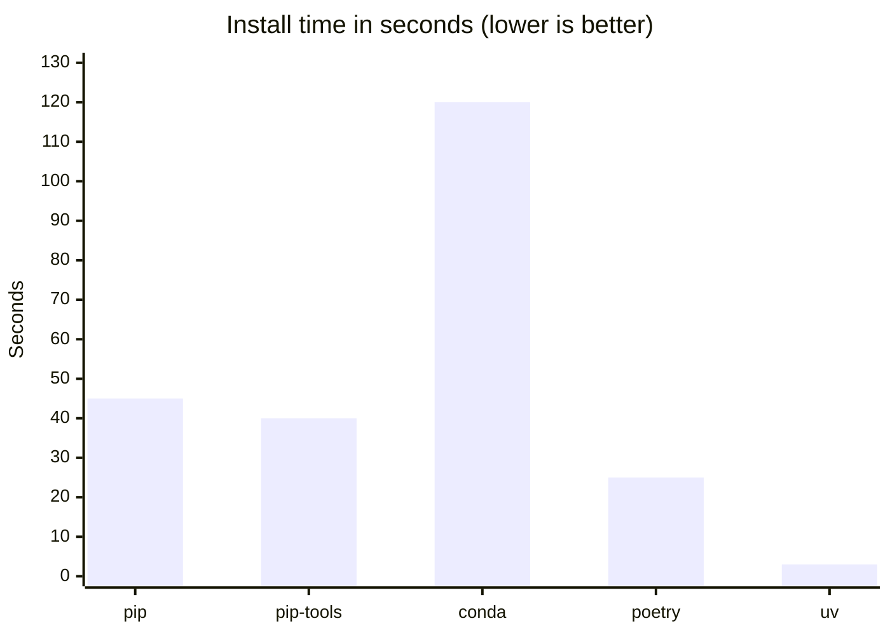

# Project Overview

## Overview

Setting up a Python project has changed significantly over the past two decades. What once required a fragmented mix of configuration files has since converged on a single standard with `pyproject.toml`. Alongside this consolidation, a new generation of developer tools has emerged that takes full advantage of the modern standard. Tools like [uv](https://docs.astral.sh/uv/) and [Ruff](https://docs.astral.sh/ruff/) enable a scalable and streamlined project setup with minimal configuration overhead.

Depsight embraces this modern stack. Metadata, dependencies, build system configuration, and tool settings all live in a single `pyproject.toml`, and `uv` manages the full dependency lifecycle from installation to publishing.

---

## Project Configuration

### Python Project Configuration in the Past

In 1998, `distutils` introduced `setup.py`, an imperative Python script that served as the build entry point for a project. Package metadata such as the `name`, `version`, and `description` were declared as function arguments inside executable code. A `requires` keyword existed for declaring dependencies, but it was purely informational metadata. No tool ever used it to download or install packages automatically; developers had to find, download, and install each dependency by hand.

=== "`setup.py`"
    ```python
    from distutils.core import setup

    setup(
        name="my-package",
        version="1.0.0",
        description="A sample package",
        requires=[
            "lxml (>=0.9)",
        ],
    )
    ```

Around 2004, `setuptools` extended `setup.py` with automatic package discovery and replaced the inert `requires` with `install_requires`, which actually caused dependencies to be resolved and installed. Metadata, however, remained executable Python code. Consequently, any tool had to run the file just to read the package name or version, which was both a security risk and a barrier to static tooling.

=== "`setup.py`"
    ```python
    from setuptools import setup, find_packages

    setup(
        name="my-package",
        version="2.0.0",
        description="A sample package",
        packages=find_packages(),
        install_requires=[
            "lxml>=1.0",
        ],
    )
    ```

In 2008, `pip` was released and introduced `requirements.txt` as a convention for pinning exact dependency versions alongside the existing `setup.py`. Some teams also started maintaining a separate `requirements-dev.txt` for development tools like test runners and linters, which meant keeping multiple files in sync manually.

=== "`setup.py`"

    ```python
    from setuptools import setup, find_packages

    setup(
        name="my-package",
        version="3.0.0",
        description="A sample package",
        packages=find_packages(),
        install_requires=[
            "lxml>=1.0",
        ],
    )
    ```

=== "`requirements.txt`"

    ```text
    lxml==1.3.6
    ```

=== "`requirements-dev.txt`"

    ```text
    pytest==2.3.5
    ```

In late 2016, `setuptools 30.3` introduced full support for declarative metadata in `setup.cfg`, moving all package metadata out of executable Python code and into a static configuration file. Runtime dependencies could be declared under `[options] install_requires`, and development extras under `[options.extras_require]`, installable via `pip install -e ".[dev]"`.

However, the entries under `install_requires` and `extras_require`only expressed loose constraints and did not pin exact versions. A separate `requirements.txt` (and `requirements-dev.txt`) was therefore still maintained alongside `setup.cfg` to lock exact versions for reproducible installs. And despite all of this, `setup.py` was still required because `pip` internally depended on it. Consequently, removing it would cause installs to fail entirely:

=== "`pip`"

    ```
    $ pip install -e .
    Obtaining file:///{PATH_TO_PROJECT_ROOT}/my-package
    ERROR: file:///{PATH_TO_PROJECT_ROOT}/my-package does not appear to be a Python project: neither 'setup.py' nor 'pyproject.toml' found.
    ```

=== "`uv`"

    ```
    $ uv sync
    error: No `pyproject.toml` found in current directory or any parent directory
    ```

Projects therefore had to keep `setup.cfg`, `setup.py`, `requirements.txt`, and `requirements-dev.txt` in sync manually.

=== "`setup.cfg`"

    ```ini
    [metadata]
    name = my-package
    version = 4.0.0
    description = A sample package

    [options]
    packages = find:
    install_requires =
        lxml>=3.0

    [options.extras_require]
    dev =
        pytest>=3.2
    ```

=== "`setup.py`"

    ```python
    from setuptools import setup
    setup()
    ```

=== "`requirements.txt`"

    ```text
    lxml==3.6.4
    ```

=== "`requirements-dev.txt`"

    ```text
    pytest==3.2.3
    ```

### Python Project Configuration Nowadays

#### Single Source of True

In 2016 the fragmentation of project configuration across several files ended, since [PEP 517](https://peps.python.org/pep-0517/) and [PEP 518](https://peps.python.org/pep-0518/) introduced `pyproject.toml` as a standard home for build system metadata. [PEP 621](https://peps.python.org/pep-0621/) completed the picture in 2020 by standardising the `[project]` table for package metadata.

The `[project]` table consolidates everything that used to live across `setup.py` and `setup.cfg`. It declares the package name, version, description, and a `dependencies` list that serves as the canonical declaration of runtime requirements, replacing `requirements.txt`. The `[build-system]` table specifies the backend responsible for assembling the project into a distributable artifact. The `[dependency-groups]` table takes care of development and documentation tooling separately from runtime requirements, replacing scattered `requirements-dev.txt` files with a structured, first-class concept inside the same file. Finally, `[tool.*]` sections configure linters, formatters, and test runners directly in `pyproject.toml`, removing the need for separate files such as `.flake8` or `pytest.ini`.

=== "`pyproject.toml`"
    ```toml
    [project]
    name = "my-package"
    version = "5.0.0"
    description = "A sample package"
    readme = "README.md"
    requires-python = ">=3.12"
    dependencies = [
        "lxml>=3.0",
    ]

    [build-system]
    requires = ["uv_build>=0.11.1,<0.12"]
    build-backend = "uv_build"

    [dependency-groups]
    dev = [
        "pytest>=9.0.2",
        "ruff>=0.15.8",
    ]
    docs = [
        "mkdocs>=1.6",
        "mkdocs-material>=9.5",
    ]

    # replaces: pytest.ini / tox.ini
    [tool.pytest.ini_options]
    testpaths = ["tests"]
    pythonpath = ["src"]
    ```

#### Project Orchestration

The [standardization](#single-source-of-true) of `pyproject.toml` gave Python tooling a stable project configuration to build unified workflows on top of. Tools such as [Poetry](https://python-poetry.org/) (`poetry new`, `poetry add`, `poetry build`, `poetry publish`) and [uv](https://docs.astral.sh/uv/) (`uv init`, `uv add`, `uv sync`, `uv build`, `uv publish`) now cover the full lifecycle of a Python project from initialization through publishing within a single tool. This pattern of language-native project orchestration is well established across ecosystems — `npm` in JavaScript, `cargo` in Rust, and `go mod` in Go follow the same principle. 

Depsight leverages uv's capabilities across its full lifecycle, covering [dependency management](#dependency-management), [building](#build-management), and [publishing](../integration_and_deployment/distribution.md#package-deployment), each of which is described in the sections below. The init phase, which bootstraps the project structure, is described here. Depsight's own project was initialized with a single command:

```bash
uv init my-package --build-backend "uv"
```

This generates a ready-to-use project scaffold with a `pyproject.toml`, a `src/` layout, a `.python-version` file, and an initial Git repository:

```
my-package/
├── .git/
├── .gitignore
├── .python-version
├── pyproject.toml
├── README.md
└── src/
    └── my_package/
        └── __init__.py
```

Dependencies can then be added with `uv add`, which updates `pyproject.toml`, pins versions in a dedicated [lockfile](#lockfile), and installs the packages in one step:

```bash
uv add lxml
uv add --group dev ruff
```

The first command adds a runtime dependency under `[project].dependencies`, the second a development tool under `[dependency-groups].dev`. The resulting `pyproject.toml` reflects both additions:

```toml
[project]
name = "my-package"
version = "0.1.0"
description = "Add your description here"
readme = "README.md"
requires-python = ">=3.12"
dependencies = [
    "lxml>=6.0.2",
]

[build-system]
requires = ["uv_build>=0.11.1,<0.12"]
build-backend = "uv_build"

[dependency-groups]
dev = [
    "pytest>=9.0.2",
    "ruff>=0.15.8"
]
```

---

## Development Tools

### Build Management

Build management is the process of packaging Python source code into [distributable artifacts](./../integration_and_deployment/distribution.md#python-wheels). [PEP 517](https://peps.python.org/pep-0517/) defined a standard interface between build frontends and build backends. A build frontend is the tool the developer runs (e.g. `uv build`, `python -m build`) and orchestrates the build process. A build backend is the library that does the actual work of compiling metadata and assembling the wheel; it is declared in the `[build-system]` table in `pyproject.toml` and invoked by the frontend.

Depsight uses `uv_build` as its build backend, which has been a stable, PEP 517-compliant backend since uv `v0.7.19`. `uv_build` is shipped with `uv` but is not user-facing; `uv build` remains the command for normal use. The backend is declared in `pyproject.toml`:

```toml
[build-system]
requires = ["uv_build>=0.11.1,<0.12"]
build-backend = "uv_build"
```

#### Alternatives

The most widely adopted alternative is [Setuptools](https://pypi.org/project/setuptools/), which offers the broadest ecosystem compatibility and is a sensible default when tooling interoperability matters most. [Hatchling](https://pypi.org/project/hatchling/) is a modern option that reads all metadata directly from `pyproject.toml`, enforces standards compliance more strictly, and produces reproducible builds by default.

### Dependency Management

Dependency management is the process of declaring which third-party packages a project needs, resolving compatible versions, and installing them reproducibly across machines. In Python, this has historically been fragmented across tools such as `setup.py`, `requirements.txt`, `pip`, SPoetry, and pip-tools, which is why modern workflows increasingly converge on `pyproject.toml` plus a lockfile. A good Python dependency manager therefore needs to handle both packaging metadata and environment reproducibility.

Depsight uses [**uv**](https://docs.astral.sh/uv/) as its package manager. It is implemented in Rust and released by the team behind [Ruff](#linter-and-formatter). uv resolves and installs packages significantly faster than `pip` or any other Python dependency manager, using parallel downloads and a shared global cache. 



Beyond raw speed, uv integrates natively with `pyproject.toml`. Instead of maintaining separate `requirements.txt` files, uv reads dependency groups directly from `[dependency-groups]` and installs exactly what each context needs. A user can run `uv sync` to install the runtime dependencies declared in `[project].dependencies`. Additionally, when passing `--group dev` or `--group docs` to the `uv sync` command, uv installs the corresponding group, while `uv sync --all-groups` brings in everything at once. This makes local development, CI runs, and documentation builds fully reproducible with a single command and no extra tooling.

#### Lockfile

One of `uv`'s most important capabilities is generating and maintaining a lockfile. Running `uv sync` resolves the full dependency graph, that includes both direct and transitive dependencies, and writes the result to `uv.lock`. Committing this file to version control makes the project fully reproducible; thus, every developer, CI run, and production build has `uv` parse the exact versions directly from the lockfile, installing bit-for-bit identical packages.

The excerpt below from Depsight's `uv.lock` shows the entry for `click`, one of its direct dependencies:

- **`version`**: the exact resolved version (`8.3.1`)
- **`source`**: the registry it was fetched from (`pypi.org`)
- **`sdist` / `wheels`**: download URLs with SHA-256 hashes for both the source distribution and the wheel
- **`dependencies`**: transitive dependencies, each with:
    - `name`: the package name (here `colorama`)
    - `marker`: a platform condition restricting when the dependency is required (here Windows only: `sys_platform == 'win32'`)


```toml
[[package]]
name = "click"
version = "8.3.1"
source = { registry = "https://pypi.org/simple" }
dependencies = [
    { name = "colorama", marker = "sys_platform == 'win32'" },
]
sdist = { url = "https://files.pythonhosted.org/.../click-8.3.1.tar.gz", hash = "sha256:12ff478..." }
wheels = [
    { url = "https://files.pythonhosted.org/.../click-8.3.1-py3-none-any.whl", hash = "sha256:981153a..." },
]

# transitive dependency of click (Windows only)
[[package]]
name = "colorama"
version = "0.4.6"
source = { registry = "https://pypi.org/simple" }
sdist = { url = "https://files.pythonhosted.org/.../colorama-0.4.6.tar.gz", hash = "sha256:08695f5..." }
wheels = [
    { url = "https://files.pythonhosted.org/.../colorama-0.4.6-py2.py3-none-any.whl", hash = "sha256:4f1d999..." },
]
```

#### Updating Dependencies

Any dependency change starts in `pyproject.toml` by adding a new package or adjust a version constraint, then run `uv sync`. uv compares the constraints against what is already pinned in `uv.lock` and, if the locked version still satisfies the updated constraint, leaves the lockfile untouched and installs exactly what was already recorded. To explicitly upgrade a specific package to the latest version within its constraint, run `uv lock --upgrade-package click` followed by `uv sync`. To upgrade all packages at once, `uv lock --upgrade` re-resolves the entire dependency graph before installing.

!!! warning "`uv.lock` takes precedence over `pyproject.toml`"
    Bumping `click>=8.1.7` to `click>=8.2.0` in `pyproject.toml` and then running `uv sync` will still install `click 8.3.1` if that is what the lockfile already pins, because `8.3.1` satisfies `>=8.2.0`. The `pyproject.toml` only defines the allowed range — the lockfile determines the actual installed version. Deleting `uv.lock` is not the right solution, as it forces a full re-resolution of all packages from scratch.

---

### Testing

Testing is the practice of executing code in a controlled way to verify that it behaves as intended and to catch regressions when the codebase changes. In Python, tests are usually written as regular Python functions that assert on expected behavior, which keeps the feedback loop simple and accessible. The ecosystem is centered around tools such as `pytest`, which handle discovery, fixtures, parametrization, and failure reporting.

Automated tests verify that the code behaves as expected and catch regressions before they reach other developers or production. Without a test runner, verifying correctness means manually re-running the application after every change — which does not scale and is error-prone. Depsight uses [pytest](https://docs.pytest.org/). A basic test looks like this:

```python
# tests/test_math.py
def add(a: int, b: int) -> int:
    return a + b

def test_add() -> None:
    assert add(2, 3) == 5
    assert add(-1, 1) == 0
```

Running `python -m pytest tests/` discovers and executes all `test_*` functions automatically.

---

### Code Quality Tools

#### Linter and Formatter

Linters and formatters improve source code quality before the program is ever run. In Python, this is especially valuable because the language emphasizes readability and has many style and correctness conventions that benefit from automatic enforcement. Modern Python tooling often combines import sorting, formatting, and static rule checking into a small number of fast commands that can run locally and in CI.

Depsight uses [Ruff](https://docs.astral.sh/ruff/) as its linter and formatter. Ruff is implemented in Rust and represents a modern consolidation of the Python tooling ecosystem. It is a full replacement of `flake8`, `isort`, and `black` in a single binary while being significantly faster than any of them. Rather than maintaining separate configuration files like `.flake8` or `tox.ini`, Ruff reads all its settings from `pyproject.toml` under `[tool.ruff]`, keeping the entire project configuration in one place. Running `ruff check` on the following code

```python
import os  # unused import
import sys

x=1+2      # missing whitespace around operator
print(x)
```

produces:

```
error[F401]: `os` imported but unused
error[E225]: missing whitespace around operator
```

Both issues are caught before the code is ever run or reviewed.

#### Type Checker

Type checking verifies that values are used consistently with their declared types, such as ensuring that a function expecting a `str` is not given an `int`. Python remains dynamically typed at runtime, but its type hint system has grown into a major part of modern development because it allows tools to analyze code statically before execution. In practice, Python type checkers improve refactoring safety, editor support, and API clarity, especially in larger projects and plugin-based architectures.

Depsight uses [mypy](https://mypy.readthedocs.io/) as its static type checker. Python is dynamically typed by default, which means type errors only surface at runtime. mypy analyses the code without running it and catches type mismatches, missing attributes, and incorrect function signatures before they can become runtime failures. It replaces the need for a standalone `mypy.ini` configuration file by reading its settings from `pyproject.toml` under `[tool.mypy]`. For a project like Depsight that exposes a plugin API, type annotations enforced by mypy also serve as living documentatio. Callers know exactly what a function expects and returns without having to read the implementation. Running `mypy` on the following code:

```python
def greet(name: str) -> str:
    return "Hello, " + name

result: int = greet("world")  # assigned to int, but greet returns str
print(result.upper())         # int has no upper() — runtime crash waiting to happen
```

produces:

```
error: Incompatible types in assignment (expression has type "str", variable has type "int")
```
