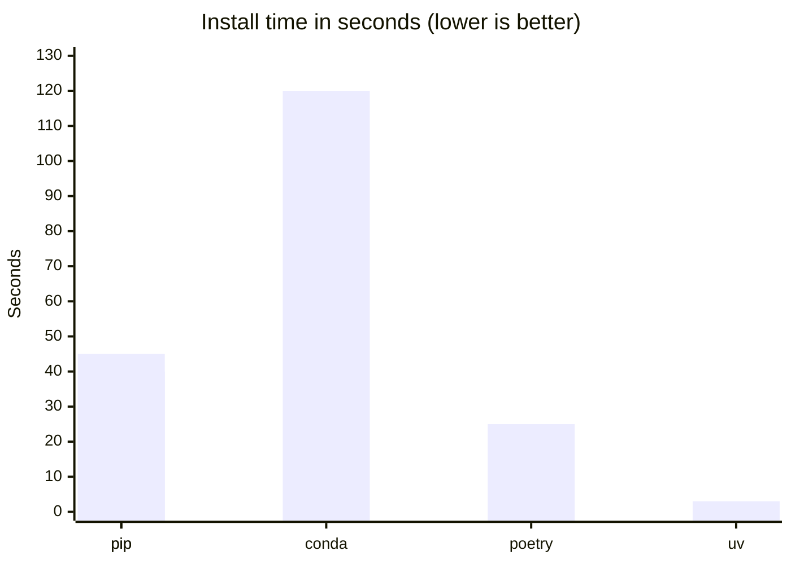

# Project Toolchain

## Overview

Setting up a Python project has changed significantly over the past two decades. What once required a fragmented mix of configuration files has since converged on a single standard with `pyproject.toml`. Alongside this consolidation, a new generation of developer tools has emerged that takes full advantage of the modern standard. Tools like [uv](https://docs.astral.sh/uv/) and [Ruff](https://docs.astral.sh/ruff/) enable a scalable and streamlined project setup with minimal configuration overhead.

Depsight embraces this modern stack. Metadata, dependencies, build system configuration, and tool settings all live in a single `pyproject.toml`, and `uv` manages the full dependency lifecycle from installation to publishing.

---

## Project Configuration

### Python Project Configuration in the Past

In 1998, `distutils` introduced `setup.py`, an imperative Python script that served as the build entry point for a project. Package metadata such as the `name`, `version`, and `description` were declared as function arguments inside executable code; however, there was no concept of dependency management yet. This changed in 2004 when `setuptools` extended `setup.py` with automatic package discovery and dependency declarations via `install_requires`, though metadata remained executable Python code. Consequently, any tool had to run the file just to read the package name or version, which was both a security risk and a barrier to static tooling.

=== "`setup.py`"
    ```python
    from setuptools import setup, find_packages

    setup(
        name="my-package",
        version="1.0.0",
        description="A sample package",
        packages=find_packages(),
        install_requires=[
            "lxml>=1.0",
            "docutils>=0.4",
        ],
    )
    ```

In 2008, `pip` was released and introduced `requirements.txt` as a convention for pinning exact dependency versions alongside the existing `setup.py`. Some teams also started maintaining a separate `requirements-dev.txt` for development tools like test runners and linters, which meant keeping multiple files in sync manually.

=== "`setup.py`"

    ```python
    from setuptools import setup, find_packages

    setup(
        name="my-package",
        version="1.0.0",
        description="A sample package",
        packages=find_packages(),
        install_requires=[
            "SQLAlchemy>=0.5",
            "Jinja2>=2.4",
        ],
    )
    ```

=== "`requirements.txt`"

    ```text
    SQLAlchemy==0.5.8
    Jinja2==2.4.1
    ```

=== "`requirements-dev.txt`"

    ```text
    nose==0.11.1
    pyflakes==0.4.0
    ```

In late 2016, `setuptools 30.3` introduced full support for declarative metadata in `setup.cfg`, moving all package metadata out of executable Python code and into a static configuration file. Runtime dependencies could be declared under `[options] install_requires`, and development extras under `[options.extras_require]`, installable via `pip install -e ".[dev]"`. However, neither `install_requires` nor `extras_require` pin exact versions — they only express loose constraints. A separate `requirements.txt` (and `requirements-dev.txt`) was therefore still maintained alongside `setup.cfg` to lock exact versions for reproducible installs. And despite all of this, `setup.py` was still required because `pip` internally depended on it. Projects therefore had to keep `setup.cfg`, `setup.py`, `requirements.txt`, and `requirements-dev.txt` in sync manually.

=== "`setup.cfg`"

    ```ini
    [metadata]
    name = my-package
    version = 1.0.0
    description = A sample package

    [options]
    packages = find:
    install_requires =
        requests>=2.18
        click>=6.7

    [options.extras_require]
    dev =
        pytest>=3.2
        flake8>=3.4
    ```

=== "`setup.py`"

    ```python
    from setuptools import setup
    setup()
    ```

=== "`requirements.txt`"

    ```text
    requests==2.18.4
    click==6.7
    ```

=== "`requirements-dev.txt`"

    ```text
    pytest==3.2.3
    flake8==3.4.1
    ```

### Python Project Configuration Nowadays

In 2016 the fragmentation of project configuration across several files ended, since [PEP 517](https://peps.python.org/pep-0517/) and [PEP 518](https://peps.python.org/pep-0518/) introduced `pyproject.toml` as a standard home for build system metadata. [PEP 621](https://peps.python.org/pep-0621/) completed the picture in 2020 by standardising the `[project]` table for package metadata.

The `[project]` table consolidates everything that used to live across `setup.py` and `setup.cfg`, declaring the package name, version, description, and runtime dependencies in one place. The `[build-system]` table tells build frontends like `uv build` or `pip wheel` which backend to delegate to, and the `[tool.*]` tables configure linters, formatters, and test runners without the need for separate configuration files spread across the project. Dependency groups further tighten the setup by isolating development and documentation tools from runtime dependencies, replacing scattered `requirements-dev.txt` files with a structured, first-class concept directly within `pyproject.toml`.

=== "`pyproject.toml`"
    ```toml
    # replaces: setup.py / setup.cfg [metadata] + [options]
    [project]
    name = "depsight"
    version = "0.1.0"
    description = "A modular dependency analysis framework"
    dependencies = [        # replaces: install_requires + requirements.txt
        "click>=8.1.7",
        "rich>=13.7.0",
        "rich-click>=1.7.0",
    ]

    # replaces: setup.py (the build entry point)
    [build-system]
    requires = ["setuptools>=61.0"]
    build-backend = "setuptools.build_meta"

    # replaces: requirements-dev.txt, requirements-docs.txt
    [dependency-groups]
    dev = [
        "mypy>=1.10",
        "pytest>=8.0",
        "ruff>=0.4",
    ]
    docs = [
        "mkdocs>=1.6",
        "mkdocs-material>=9.5",
        "mkdocs-mermaid2-plugin>=1.1",
    ]

    # replaces: pytest.ini / tox.ini
    [tool.pytest.ini_options]
    testpaths = ["tests"]
    pythonpath = ["src"]

    # replaces: .flake8 / tox.ini [flake8]
    [tool.ruff]
    line-length = 120

    [tool.ruff.lint]
    select = ["E", "F", "I"]
    ignore = ["E501"]

    # replaces: mypy.ini
    [tool.mypy]
    strict = true
    ignore_missing_imports = true
    ```

---

## Development Tooling Stack

### Dependency Management

Depsight uses [**uv**](https://docs.astral.sh/uv/) instead of pip. uv is written in Rust and designed as a drop-in replacement for pip and pip-tools, but drastically faster and with a proper lockfile workflow out of the box.

#### Why uv?

`pip` was built in an era before lockfiles, dependency groups, or fast resolution were priorities. Installing a moderately sized project with pip can take tens of seconds due to serial network requests and a slow resolver. `conda` solves environment isolation but is slow and heavyweight. `venv` + `pip-tools` gets closer but requires two tools and manual coordination.

`uv` addresses all of this in a single binary:

- **Lockfile by default** — `uv sync` generates `uv.lock`, pinning every transitive dependency. No separate `pip-compile` step needed.
- **Dependency groups** — dev and docs dependencies are first-class, defined directly in `pyproject.toml`.
- **Speed** — The resolver and installer are written in Rust with parallel downloads and a shared package cache.

#### Performance

The chart below shows approximate real-world install times for a typical mid-size Python project (50–100 packages):



Of the tools above, only `pip-tools`, `poetry`, and `uv` produce a proper lockfile. `pip freeze` is a manual snapshot, not a managed lockfile, and `conda`'s `environment.yml` does not pin transitive dependencies.

#### Common Commands

```bash
# Install all dependencies (including dev and docs groups)
uv sync --all-groups

# Add a new runtime dependency
uv add <package>

# Add a dev dependency
uv add --group dev <package>

# Build a distributable wheel
uv build

# Run a command inside the managed environment
uv run depsight --help
```

| Group | Contents | Install command |
|-------|----------|----------------|
| **Runtime** | Click, Rich, rich-click | `uv sync` |
| **Dev** | Ruff, mypy, pytest | `uv sync --group dev` |
| **Docs** | MkDocs, Material theme, Mermaid | `uv sync --group docs` |
| **All** | Everything above | `uv sync --all-groups` |

#### Lockfile

`uv sync` generates a `uv.lock` file that pins exact versions of every transitive dependency. This file is committed to version control so that every developer, every CI run, and every production build installs exactly the same packages:

```toml
[[package]]
name = "click"
version = "8.3.1"
source = { registry = "https://pypi.org/simple" }

[[package]]
name = "rich"
version = "13.9.4"
source = { registry = "https://pypi.org/simple" }
```

---

### Testing

Automated tests verify that the code behaves as expected and catch regressions before they reach other developers or production. Without a test runner, verifying correctness means manually re-running the application after every change — which does not scale and is error-prone. Depsight uses [pytest](https://docs.pytest.org/). A basic test looks like this:

```python
# tests/test_math.py
def add(a: int, b: int) -> int:
    return a + b

def test_add() -> None:
    assert add(2, 3) == 5
    assert add(-1, 1) == 0
```

Running `python -m pytest tests/` discovers and executes all `test_*` functions automatically.

---

### Code Quality Tools

Linters, formatters, and type checkers read their settings from `pyproject.toml` under `[tool.<name>]`, eliminating the need for `tox.ini`, `.flake8`, `mypy.ini`, and similar files.

#### Linter and Formatter

A linter catches common mistakes — unused imports, undefined variables, unreachable code — before they cause bugs at runtime. A formatter enforces a consistent code style automatically, eliminating style debates in code reviews and keeping the diff history clean. Configuring both as part of the project means every contributor gets the same rules, regardless of their local editor setup. Depsight uses [Ruff](https://docs.astral.sh/ruff/), a Rust-based tool that replaces flake8, isort, and black in one binary. Running `ruff check` on the following code:

```python
import os  # unused import
import sys

x=1+2      # missing whitespace around operator
print(x)
```

produces:

```
error[F401]: `os` imported but unused
error[E225]: missing whitespace around operator
```

Both issues are caught before the code is ever run or reviewed.

#### Type Checker

Python is dynamically typed, which means type errors only surface at runtime — often in production, and often in error paths that are rarely exercised. A static type checker analyses the code without running it, catching type mismatches, missing attributes, and incorrect function signatures early. For a project like Depsight that exposes a plugin API, type annotations also serve as living documentation — callers know exactly what a function expects and returns. Depsight uses [mypy](https://mypy.readthedocs.io/). Running `mypy` on the following code:

```python
def greet(name: str) -> str:
    return "Hello, " + name

result: int = greet("world")  # assigned to int, but greet returns str
print(result.upper())         # int has no upper() — runtime crash waiting to happen
```

produces:

```
error: Incompatible types in assignment (expression has type "str", variable has type "int")
```

The bug is caught statically — no test run required.